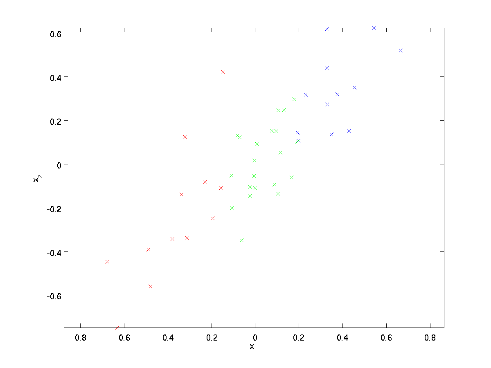
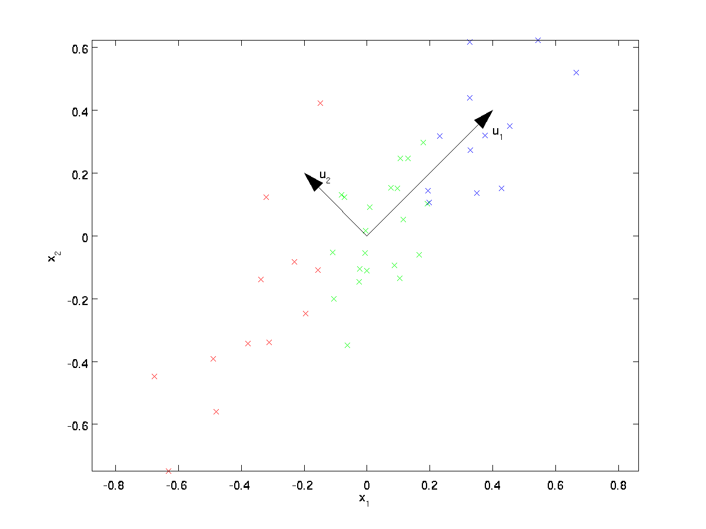
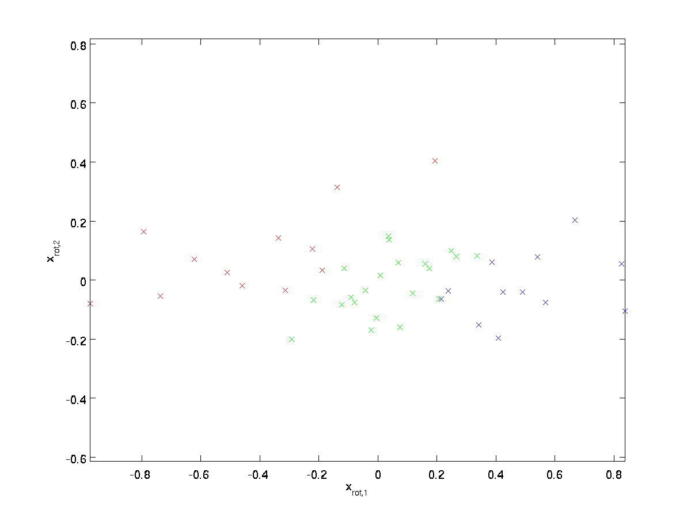
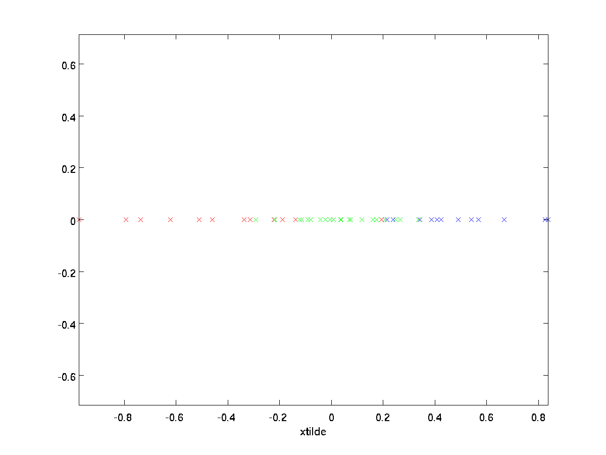
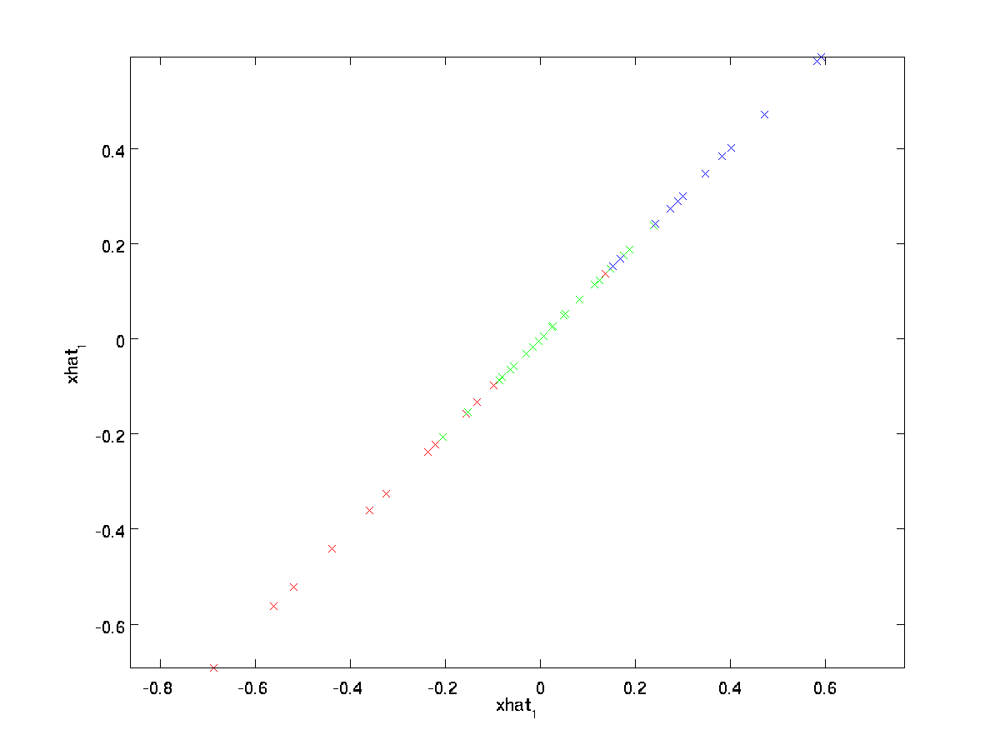
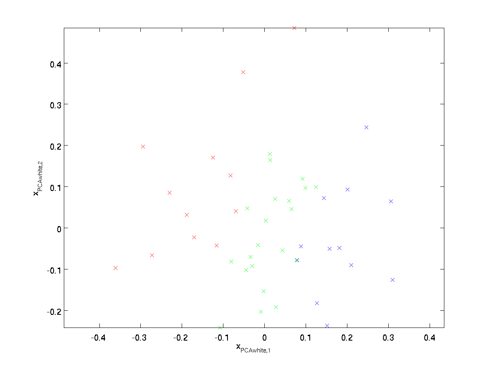
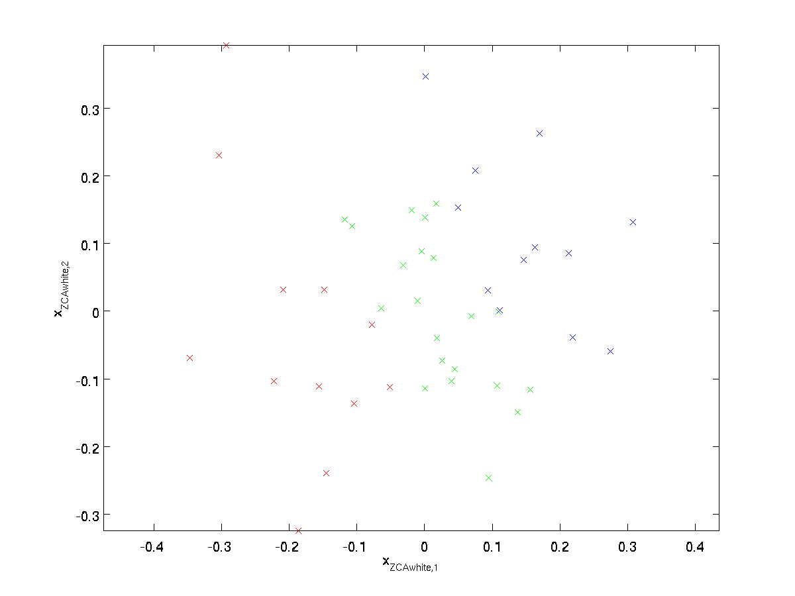

## 主成分分析白化（PCA Whitening）  
注：本章节翻译完全参考旧版 UFLDL 中文教程。  
### 引言（Introduction）  

主成分分析（PCA）是一种能够极大提升无监督特征学习速度的数据降维算法。更重要的是，理解PCA算法，对实现白化算法有很大的帮助，很多算法都先用白化算法作预处理步骤。  

假设你使用图像来训练算法，因为图像中相邻的像素高度相关，输入数据是有一定冗余的。具体来说，假如我们正在训练的 $16 \times 16$ 灰度值图像，记为一个 $256$ 维向量 $\textstyle x \in \Re^{256}$ ，其中特征值 $\textstyle x_j$ 对应每个像素的亮度值。由于相邻像素间的相关性， PCA 算法可以将输入向量转换为一个维数低很多的近似向量，而且误差非常小。  

### 实例与数学背景（Example and Mathematical Background）  

在实例中，使用的输入数据集表示为 $\textstyle \{x^{(1)}, x^{(2)}, \ldots, x^{(m)}\}$ ，维度 $\textstyle n=2$ 即 $\textstyle x^{(i)} \in \Re^2$ 。假设我们想把数据从 $2$ 维降到 $1$ 维。（在实际应用中，也许需要把数据从 $256$ 维降到 $50$ 维；在这里使用低维数据，主要是为了更好地可视化算法的行为）。下图是数据集：  

<center></center>  

这些数据已经进行了预处理，使得每个特征 $\textstyle x_1$ 和 $\textstyle x_2$ 具有相同的均值（零）和方差。  

为方便展示，根据 $\textstyle x_1$ 值的大小，我们将每个点分别涂上了三种颜色之一，但该颜色并不用于算法而仅用于图解。  

PCA算法将寻找一个低维空间来投影我们的数据。从下图中可以看出， $\textstyle u_1$ 是数据变化的主方向，而 $\textstyle u_2$ 是次方向。  

<center></center>  

也就是说，数据在 $\textstyle u_1$ 方向上的变化要比在 $\textstyle u_2$ 方向上大。为更形式化地找出方向 $\textstyle u_1$ 和 $\textstyle u_2$ ，我们首先计算出矩阵 $\textstyle \Sigma$ ，如下所示：  

$$
\begin{align}
\Sigma = \frac{1}{m} \sum_{i=1}^m (x^{(i)})(x^{(i)})^T. 
\end{align} 
$$

假设 $\textstyle x$ 的均值为零，那么 $\textstyle \Sigma$ 就是 $x$ 的协方差矩阵。（符号 $\textstyle \Sigma$ ，读 "Sigma" ，是协方差矩阵的标准符号。虽然看起来与求和符号 $\sum_{i=1}^n i$ 比较像，但它们其实是两个不同的概念。）  

可以证明，数据变化的主方向 $\textstyle u_1$ 就是协方差矩阵 $\textstyle \Sigma$ 的主特征向量，而 $\textstyle u_2$ 是次特征向量。  

注：如果你对如何得到这个结果的具体数学推导过程感兴趣，可以参看 CS229（机器学习） PCA 部分的课件（链接在本页底部）。但如果仅仅是想跟上本课，可以不必如此。  

你可以通过标准的数值线性代数运算软件求得特征向量（见实现说明）.我们先计算出协方差矩阵$\textstyle \Sigma$ 的特征向量，按列排放，而组成矩阵 $\textstyle U$ ：  

$$
\begin{align} 
U = \begin{bmatrix} | & | & & | \\ u_1 & u_2 & \cdots & u_n \\ | & | & & | \end{bmatrix}
\end{align} 
$$

此处， $\textstyle u_1$ 是主特征向量（对应最大的特征值）， $\textstyle u_2$ 是次特征向量。以此类推，另记 $\textstyle \lambda_1, \lambda_2, \ldots, \lambda_n$ 为相应的特征值。

在本例中，向量 $\textstyle u_1$ 和 $\textstyle u_2$ 构成了一个新基，可以用来表示数据。令 $\textstyle x \in \Re^2$ 为训练样本，那么 $\textstyle u_1^Tx$ 就是样本点 $\textstyle x$ 在维度 $\textstyle u_1$ 上的投影的长度（幅值）。同样的， $\textstyle u_2^Tx$ 是 $\textstyle x$ 投影到 $\textstyle u_2$ 维度上的幅值。  

### 旋转数据（Rotating the Data）  

至此，可以把 $\textstyle x$ 用 $\textstyle (u_1, u_2)$ 基表达为：

$$
\begin{align} 
x_{\rm rot} = U^Tx = 
\begin{bmatrix} 
u_1^Tx \\ u_2^Tx \end{bmatrix} 
\end{align} 
$$

  （下标 “rot” 来源于单词 “rotation” ，意指这是原数据经过旋转（也可以说成映射）后得到的结果）

对数据集中的每个样本 $\textstyle i$ 分别进行旋转： $\textstyle x_{\rm rot}^{(i)} = U^Tx^{(i)} for every \textstyle i$ ，然后把变换后的数据 $\textstyle x_{\rm rot}$ 显示在坐标图上，可得： 

<center></center>  

这就是把训练数据集旋转到 $\textstyle u_1$ ， $\textstyle u_2$ 基后的结果。一般而言，运算 $\textstyle U^Tx$ 表示旋转到基 $\textstyle u_1,\textstyle u_2, ...,\textstyle u_n$ 之上的训练数据。矩阵 $\textstyle U$ 有正交性，即满足 $\textstyle U^TU = UU^T = I$ ，所以若想将旋转后的向量 $\textstyle x_{\rm rot}$ 还原为原始数据 $\textstyle x$ ，将其左乘矩阵 $\textstyle U$ 即可： $\textstyle x=U x_{\rm rot}$ ，验算一下： $\textstyle U x_{\rm rot} = UU^T x = x.$ 

### 数据降维（Reducing the Data Dimension）

数据的主方向就是旋转数据的第一维 $\textstyle x_{{\rm rot},1}$ 。因此，若想把这数据降到一维，可令：

$$
\begin{align} 
\tilde{x}^{(i)} = x_{{\rm rot},1}^{(i)} = u_1^Tx^{(i)} \in \Re. 
\end{align} 
$$

更一般的，假如想把数据 $\textstyle x \in \Re^n$ 降到 $\textstyle k$ 维表示 $\textstyle \tilde{x} \in \Re^k$ （令 $\textstyle k < n$ ）,只需选取 $\textstyle x_{\rm rot}$ 的前 $\textstyle k$ 个成分，分别对应前 $\textstyle k$ 个数据变化的主方向。

PCA 的另外一种解释是： $\textstyle x_{\rm rot}$ 是一个 $\textstyle n$ 维向量，其中前几个成分可能比较大（例如，上例中大部分样本第一个成分 $\textstyle x_{{\rm rot},1}^{(i)} = u_1^Tx^{(i)}$ 的取值相对较大），而后面成分可能会比较小（例如，上例中大部分样本的 $\textstyle x_{{\rm rot},2}^{(i)} = u_2^Tx^{(i)}$ 较小）。

PCA 算法做的其实就是丢弃 $\textstyle x_{\rm rot}$ 中后面（取值较小）的成分，就是将这些成分的值近似为零。具体的说，设 $\textstyle \tilde{x}$ 是 $\textstyle x_{{\rm rot}}$ 的近似表示，那么将 $\textstyle x_{{\rm rot}}$ 除了前 $\textstyle k$ 个成分外，其余全赋值为零，就得到：

$$
\begin{align}
\tilde{x} = \begin{bmatrix} x_{{\rm rot},1} \\ \vdots \\ x_{{\rm rot},k} \\ 0 \\ \vdots \\ 0 \\ \end{bmatrix} \approx \begin{bmatrix} x_{{\rm rot},1} \\ \vdots \\ x_{{\rm rot},k} \\ x_{{\rm rot},k+1} \\ \vdots \\ x_{{\rm rot},n} \end{bmatrix} = x_{\rm rot} 
\end{align} 
$$

在本例中，可得 $\textstyle \tilde{x}$ 的点图如下（取 $\textstyle n=2, k=1$ ）： 

<center></center>  

然而，由于上面 $\textstyle \tilde{x}$ 的后 $\textstyle n-k$ 项均为零，没必要把这些零项保留下来。所以，我们仅用前 $\textstyle k$ 个（非零）成分来定义 $\textstyle k$ 维向量 $\textstyle \tilde{x}$ 。

这也解释了我们为什么会以 $\textstyle u_1, u_2, \ldots, u_n$ 为基来表示数据：要决定保留哪些成分变得很简单，只需取前 $\textstyle k$ 个成分即可。这时也可以说，我们“保留了前 $\textstyle k$ 个 PCA （主）成分”。  

### 还原近似数据（Recovering an Approximation of the Data）

现在，我们得到了原始数据 $\textstyle x \in \Re^n$ 的低维“压缩”表征量 $\textstyle \tilde{x} \in \Re^k$ ， 反过来，如果给定 $\textstyle \tilde{x}$ ，我们应如何还原原始数据 $\textstyle x$ 呢？查看以往章节以往章节可知，要转换回来，只需 $\textstyle x = U x_{\rm rot}$ 即可。进一步，我们把 $\textstyle \tilde{x}$ 看作将 $\textstyle x_{\rm rot}$ 的最后 $\textstyle n-k$ 个元素被置 $0$ 所得的近似表示，因此如果给定 $\textstyle \tilde{x} \in \Re^k$ ，可以通过在其末尾添加 $\textstyle n-k$ 个 $0$ 来得到对 $\textstyle x_{\rm rot} \in \Re^n$ 的近似，最后，左乘 $\textstyle U$ 便可近似还原出原数据 $\textstyle x$ 。具体来说，计算如下：

$$
\begin{align} 
\hat{x} = U \begin{bmatrix} \tilde{x}_1 \\ \vdots \\ \tilde{x}_k \\ 0 \\ \vdots \\ 0 \end{bmatrix} = \sum_{i=1}^k u_i \tilde{x}_i. 
\end{align}
$$

上面的等式基于先前对 $\textstyle U$ 的定义。在实现时，我们实际上并不先给 $\textstyle \tilde{x}$ 填 $0$ 然后再左乘 $\textstyle U$ ，因为这意味着大量的乘 $0$ 运算。我们可用 $\textstyle \tilde{x} \in \Re^k$ 来与 $\textstyle U$ 的前 $\textstyle k$ 列相乘，即上式中最右项，来达到同样的目的。将该算法应用于本例中的数据集，可得如下关于重构数据 $\textstyle \hat{x}$ 的点图： 

<center></center>  

由图可见，我们得到的是对原始数据集的一维近似重构。

在训练自动编码器或其它无监督特征学习算法时，算法运行时间将依赖于输入数据的维数。若用 $\textstyle \tilde{x} \in \Re^k$ 取代 $\textstyle x$ 作为输入数据，那么算法就可使用低维数据进行训练，运行速度将显著加快。对于很多数据集来说，低维表征量 $\textstyle \tilde{x}$ 是原数据集的极佳近似，因此在这些场合使用 PCA 是很合适的，它引入的近似误差的很小，却可显著地提高你算法的运行速度。 

### 选择主成分个数（Number of components to retain）

我们该如何选择 $\textstyle k$ ，即保留多少个 PCA 主成分？在上面这个简单的二维实验中，保留第一个成分看起来是自然的选择。对于高维数据来说，做这个决定就没那么简单：如果 $\textstyle k$ 过大，数据压缩率不高，在极限情况 $\textstyle k=n$ 时，等于是在使用原始数据（只是旋转投射到了不同的基）；相反地，如果 $\textstyle k$ 过小，那数据的近似误差太太。

决定 $\textstyle k$ 值时，我们通常会考虑不同 $\textstyle k$ 值可保留的方差百分比。具体来说，如果 $\textstyle k=n$ ，那么我们得到的是对数据的完美近似，也就是保留了 $100%$ 的方差，即原始数据的所有变化都被保留下来；相反，如果 $\textstyle k=0$ ，那等于是使用零向量来逼近输入数据，也就是只有 $0%$ 的方差被保留下来。

一般而言，设 $\textstyle \lambda_1, \lambda_2, \ldots, \lambda_n$ 表示 $\textstyle \Sigma$ 的特征值（按由大到小顺序排列），使得 $\textstyle \lambda_j$ 为对应于特征向量 $\textstyle u_j$ 的特征值。那么如果我们保留前 $\textstyle k$ 个成分，则保留的方差百分比可计算为：  

$$
\begin{align}
\frac{\sum_{j=1}^k \lambda_j}{\sum_{j=1}^n \lambda_j}. 
\end{align}
$$

在上面简单的二维实验中， $\textstyle \lambda_1 = 7.29 ，\textstyle \lambda_2 = 0.69$ 。因此，如果保留 $\textstyle k=1$ 个主成分，等于我们保留了 $\textstyle 7.29/(7.29+0.69) = 0.913$ ，即 $91.3%$ 的方差。

对保留方差的百分比进行更正式的定义已超出了本教程的范围，但很容易证明， $\textstyle \lambda_j = \sum_{i=1}^m x_{{\rm rot},j}^2$ 。因此，如果 $\textstyle \lambda_j \approx 0$ ，则说明 $\textstyle x_{{\rm rot},j}$ 也就基本上接近于 $0$ ，所以用 $0$ 来近似它并不会产生多大损失。这也解释了为什么要保留前面的主成分（对应的 $\textstyle \lambda_j$ 值较大）而不是末尾的那些。这些前面的主成分 $\textstyle x_{{\rm rot},j}$ 变化性更大，取值也更大，如果将其设为 $0$ 势必引入较大的近似误差。

以处理图像数据为例，一个惯常的经验法则是选择 $\textstyle k$ 以保留 $99\%$ 的方差，换句话说，我们选取满足以下条件的最小 $\textstyle k$ 值：

$$
\begin{align} 
\frac{\sum_{j=1}^k \lambda_j}{\sum_{j=1}^n \lambda_j} \geq 0.99. 
\end{align}
$$

对其它应用，如不介意引入稍大的误差，有时也保留 $90-98\%$ 的方差范围。若向他人介绍 PCA 算法详情，告诉他们你选择的 $\textstyle k$ 保留了 $95\%$ 的方差，比告诉他们你保留了前 $120$ 个（或任意某个数字）主成分更好理解。

### 对图像数据应用 PCA 算法（PCA on Images）  

为使 PCA 算法能有效工作，通常我们希望所有的特征 $\textstyle x_1, x_2, \ldots, x_n$ 都有相似的取值范围（并且均值接近于 $0$ ）。如果你曾在其它应用中使用过 PCA 算法，你可能知道有必要单独对每个特征做预处理，即通过估算每个特征 $\textstyle x_j$ 的均值和方差，而后将其取值范围规整化为零均值和单位方差。但是，对于大部分图像类型，我们却不需要进行这样的预处理。假定我们将在自然图像上训练算法，此时特征 $\textstyle x_j$ 代表的是像素 $\textstyle j$ 的值。所谓“自然图像”，不严格的说，是指人或动物在他们一生中所见的那种图像。

注：通常我们选取含草木等内容的户外场景图片，然后从中随机截取小图像块（如 $16 \times 16$ 像素）来训练算法。在实践中我们发现，大多数特征学习算法对训练图片的确切类型并不敏感，所以大多数用普通照相机拍摄的图片，只要不是特别的模糊或带有非常奇怪的人工痕迹，都可以使用。

在自然图像上进行训练时，对每一个像素单独估计均值和方差意义不大，因为（理论上）图像任一部分的统计性质都应该和其它部分相同，图像的这种特性被称作平稳性（ stationarity ）。

具体而言，为使 PCA 算法正常工作，我们通常需要满足以下要求：  
(1)特征的均值大致为 $0$ ；  
(2)不同特征的方差值彼此相似。  

对于自然图片，即使不进行方差归一化操作，条件(2)也自然满足，故而我们不再进行任何方差归一化操作（对音频数据，如声谱；或文本数据，如词袋向量，通常也不进行方差归一化）。实际上， PCA 算法对输入数据具有缩放不变性，无论输入数据的值被如何放大（或缩小），返回的特征向量都不改变。更正式的说：如果将每个特征向量 $\textstyle x$ 都乘以某个正数（即所有特征量被放大或缩小相同的倍数）， PCA 的输出特征向量都将不会发生变化。

既然我们不做方差归一化，唯一还需进行的规整化操作就是均值规整化，其目的是保证所有特征的均值都在 $0$ 附近。根据应用，在大多数情况下，我们并不关注所输入图像的整体明亮程度。比如在对象识别任务中，图像的整体明亮程度并不会影响图像中存在的是什么物体。更为正式地说，我们对图像块的平均亮度值不感兴趣，所以可以减去这个值来进行均值规整化。

具体的步骤是，如果 $\textstyle x^{(i)} \in \Re^{n}$ 代表 $16 \times 16$ 的图像块的亮度（灰度）值（ $\textstyle n=256$ ），可用如下算法来对每幅图像进行零均值化操作：  

$$
\mu^{(i)} := \frac{1}{n} \sum_{j=1}^n x^{(i)}_j
\\
x^{(i)}_j := x^{(i)}_j - \mu^{(i)}, for all \textstyle j
$$

请注意：  
1）对每个输入图像块 $\textstyle x^{(i)}$ 都要单独执行上面两个步骤；  
2）这里的 $\textstyle \mu^{(i)}$ 是指图像块 $\textstyle x^{(i)}$ 的平均亮度值。尤其需要注意的是，这和为每个像素 $\textstyle x_j$ 单独估算均值是两个完全不同的概念。  

如果你处理的图像并非自然图像（比如，手写文字，或者白背景正中摆放单独物体），其他规整化操作就值得考虑了，而哪种做法最合适也取决于具体应用场合。但对自然图像而言，对每幅图像进行上述的零均值规整化，是默认而合理的处理。  

### 白化（Whitening）  

我们已经了解了如何使用 PCA 降低数据维度。在一些算法中还需要一个与之相关的预处理步骤，这个预处理过程称为白化（一些文献中也叫 sphering ）。举例来说，假设训练数据是图像，由于图像中相邻像素之间具有很强的相关性，所以用于训练时输入是冗余的。白化的目的就是降低输入的冗余性；更正式的说，我们希望通过白化过程使得学习算法的输入具有如下性质：(i)特征之间相关性较低；(ii)所有特征具有相同的方差。  

### 2D 的例子（2D example）  

下面我们先用前文的 2D 例子描述白化的主要思想，然后分别介绍如何将白化与平滑和 PCA 相结合。

如何消除输入特征之间的相关性？在前文计算 $\textstyle x_{\rm rot}^{(i)} = U^Tx^{(i)}$ 时实际上已经消除了输入特征 $\textstyle x^{(i)}$ 之间的相关性。得到的新特征 $\textstyle x_{\rm rot}$ 的分布如下图所示：  

<center></center>  

这个数据的协方差矩阵如下：
$$
\begin{align} 
\begin{bmatrix} 7.29 & 0 \\ 0 & 0.69 
\end{bmatrix}. 
\end{align} 
$$    

（注：严格地讲， 这部分许多关于“协方差”的陈述仅当数据均值为 $0$ 时成立。下文的论述都隐式地假定这一条件成立。不过即使数据均值不为 $0$ ，下文的说法仍然成立，所以你无需担心这个。）


$\textstyle x_{\rm rot}$ 协方差矩阵对角元素的值为 $\textstyle \lambda_1$ 和 $\textstyle \lambda_2$ 绝非偶然。并且非对角元素值为 $0$；因此， $\textstyle x_{{\rm rot},1}$ 和 $\textstyle x_{{\rm rot},2}$ 是不相关的, 满足我们对白化结果的第一个要求 （特征间相关性降低）。

为了使每个输入特征具有单位方差，可以直接使用 $\textstyle 1/\sqrt{\lambda_i}$ 作为缩放因子来缩放每个特征 $\textstyle x_{{\rm rot},i}$ 。具体地，我们定义白化后的数据 $\textstyle x_{{\rm PCAwhite}} \in \Re^n$ 如下：

$$
\begin{align} 
x_{{\rm PCAwhite},i} = \frac{x_{{\rm rot},i} }{\sqrt{\lambda_i}}. 
\end{align}
$$

绘制出 $\textstyle x_{{\rm PCAwhite}}$ ，我们得到: 

<center></center>  

这些数据现在的协方差矩阵为单位矩阵 $\textstyle I$ 。我们说， $\textstyle x_{{\rm PCAwhite}}$ 是数据经过 PCA 白化后的版本： $\textstyle x_{{\rm PCAwhite}}$ 中不同的特征之间不相关并且具有单位方差。

白化与降维相结合。 如果你想要得到经过白化后的数据，并且比初始输入维数更低，可以仅保留 $\textstyle x_{{\rm PCAwhite}}$ 中前 $\textstyle k$ 个成分。当我们把 PCA 白化和正则化结合起来时（在稍后讨论）， $\textstyle x_{{\rm PCAwhite}}$ 中最后的少量成分将总是接近于 $0$ ，因而舍弃这些成分不会带来很大的问题。  

### ZCA 白化（ZCA Whitening）

最后要说明的是，使数据的协方差矩阵变为单位矩阵 $\textstyle I$ 的方式并不唯一。具体地，如果 $\textstyle R$ 是任意正交矩阵，即满足 $\textstyle RR^T = R^TR = I$ （说它正交不太严格， $\textstyle R$ 可以是旋转或反射矩阵），那么 $\textstyle R \,x_{\rm PCAwhite}$ 仍然具有单位协方差。在 ZCA 白化中，令 $\textstyle R = U$ 。我们定义 ZCA 白化的结果为：  

$$
\begin{align} x_{\rm ZCAwhite} = U x_{\rm PCAwhite} \end{align} 
$$

绘制 $\textstyle x_{\rm ZCAwhite}$ ，得到：

<center></center>  

可以证明，对所有可能的 $\textstyle R$ ，这种旋转使得 $\textstyle x_{\rm ZCAwhite}$ 尽可能地接近原始输入数据 $\textstyle x$ 。

当使用 ZCA 白化时(不同于 PCA 白化)，我们通常保留数据的全部 $\textstyle n$ 个维度，不尝试去降低它的维数。  

### 正则化（Regularizaton）

实践中需要实现 PCA 白化或 ZCA 白化时，有时一些特征值 $\textstyle \lambda_i$ 在数值上接近于 $0$ ，这样在缩放步骤时我们除以 $\sqrt{\lambda_i}$ 将导致除以一个接近 $0$ 的值；这可能使数据上溢（赋为大数值）或造成数值不稳定。因而在实践中，使用少量的正则化实现这个缩放过程，即在取平方根和倒数之前给特征值加上一个很小的常数 $\textstyle \epsilon$ ：  

$$
\begin{align}
x_{{\rm PCAwhite},i} = \frac{x_{{\rm rot},i} }{\sqrt{\lambda_i + \epsilon}}. 
\end{align}
$$

当 $\textstyle x$ 在区间 $\textstyle [-1,1]$ 上时, 一般取值为 $\textstyle \epsilon \approx 10^{-5}$ 。

对图像来说，这里加上 $\textstyle \epsilon$ ，对输入图像也有一些平滑（或低通滤波）的作用。这样处理还能消除在图像的像素信息获取过程中产生的噪声，改善学习到的特征（细节超出了本文的范围）。


ZCA 白化是一种数据预处理方法，它将数据从 $\textstyle x$ 映射到 $\textstyle x_{\rm ZCAwhite}$ 。事实证明这也是一种生物眼睛（视网膜）处理图像的粗糙模型。具体而言，当你的眼睛感知图像时，由于一幅图像中相邻的部分在亮度上十分相关，大多数临近的“像素”在眼中被感知为相近的值。因此，如果人眼需要分别传输每个像素值（通过视觉神经）到大脑中，会非常不划算。取而代之的是，视网膜进行一个与 ZCA 中相似的去相关操作（这是由视网膜上的 ON-型 和 OFF-型 光感受器细胞将光信号转变为神经信号完成的）。由此得到对输入图像的更低冗余的表示，并将它传输到大脑。

### 实现主成分分析和白化（Implementing PCA Whitening）

在这一节里，我们将总结 PCA ， PCA 白化和 ZCA 白化算法，并描述如何使用高效的线性代数库来实现它们。

首先，我们需要确保数据的均值（近似）为零。对于自然图像，我们通过减去每个图像块（ patch ）的均值（近似地）来达到这一目标。为此，我们计算每个图像块的均值，并从每个图像块中减去它的均值。（译注：参见 PCA 一章中“对图像数据应用 PCA 算法”一节）。 Matlab 实现如下：  

```
avg = mean(x, 1);     % 分别为每个图像块计算像素强度的均值。 
x = x - repmat(avg, size(x, 1), 1);
```

下面，我们要计算 $\textstyle \Sigma = \frac{1}{m} \sum_{i=1}^m (x^{(i)})(x^{(i)})^T$ ，如果你在 Matlab 中实现（或者在 C++，Java 等中实现，但可以使用高效的线性代数库），直接求和效率很低。不过，我们可以这样一气呵成。  

```
sigma = x * x' / size(x, 2);
```

（自己推导一下看看）这里，我们假设 $x$ 为一数据结构，其中每列表示一个训练样本（所以 $x$ 是一个 $\textstyle n×\textstyle m$ 的矩阵）。

接下来， PCA 计算 $Σ$ 的特征向量。你可以使用 Matlab 的 eig 函数来计算。但是由于 $Σ$ 是对称半正定的矩阵，用 svd 函数在数值计算上更加稳定。

具体来说，如果你使用  

```
[U,S,V] = svd(sigma);
```

那矩阵 $U$ 将包含 $Sigma$ 的特征向量（一个特征向量一列，从主向量开始排序），矩阵 $S$ 对角线上的元素将包含对应的特征值（同样降序排列）。矩阵 $\textstyle V$ 等于 $\textstyle U$ 的转置，可以忽略。

（注意 $svd$ 函数实际上计算的是一个矩阵的奇异值和奇异向量，就对称半正定矩阵的特殊情况来说，它们对应于特征值和特征向量，这里我们也只关心这一特例。关于奇异向量和特征向量的详细讨论超出了本文范围。）

最后，我们可以这样计 算 $\textstyle x_{\rm rot}$ 和 $\textstyle \tilde{x}$ ：

```
xRot = U' * x;          % 数据旋转后的结果。 
xTilde = U(:,1:k)' * x; % 数据降维后的结果，这里k希望保留的特征向量的数目。 
```

这以 $\textstyle \tilde{x} \in \Re^k$ 的形式给出了数据的PCA表示。顺便说一下，如果 $x$ 是一个包括所有训练数据的 $\textstyle n×\textstyle m$ 矩阵，这也是一种向量化的实现方式，上面的式子可以让你一次对所有的训练样本计算出 $xrot$ 和 $\tilde{x}$ 。得到的 $xrot$ 和 $\tilde{x}$ 中，每列对应一个训练样本。

为计算PCA白化后的数据 $\textstyle x_{\rm PCAwhite}$ ，可以用

```
xPCAwhite = diag(1./sqrt(diag(S) + epsilon)) * U' * x;
```

因为 $S$ 的对角线包括了特征值 $\textstyle \lambda_i$ ，这其实就是同时为所有样本 $\textstyle i$ 计算 $\textstyle x_{{\rm PCAwhite},i} = \frac{x_{{\rm rot},i} }{\sqrt{\lambda_i}}$ 的简洁表达。

最后，你也可以这样计算 ZCA 白化后的数据 $\textstyle x_{\rm ZCAwhite}$：  

```
xZCAwhite = U * diag(1./sqrt(diag(S) + epsilon)) * U' * x;
```