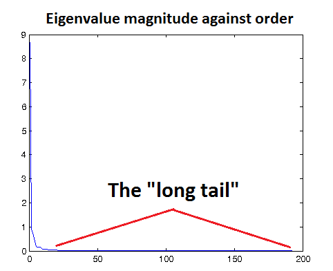

## 数据预处理（Data Preprocessing）

注：本章节翻译完全参考旧版 UFLDL 中文教程。

### 1. 概要（Overview）

数据预处理在众多深度学习算法中都起着重要作用，实际情况中，将数据做归一化和白化处理后，很多算法能够发挥最佳效果。然而除非对这些算法有丰富的使用经验，否则预处理的精确参数并非显而易见。在本节中，希望能够揭开预处理方法的神秘面纱，同时为预处理数据提供技巧（和标准流程）。

>提示：当开始处理数据时，首先要要观察数据并获知其特性。本部分将介绍一些通用技术，在实际中应该针对具体数据选择合适的预处理技术。例如一种标准的预处理方法是**对每一个数据点都减去它的均值（也被称为移除直流分量，局部均值消减，消减归一化）**，这一方法对诸如自然图像这类数据是有效的，但对非平稳的数据则不然。

### 2. 数据归一化（Data Normalization）

数据预处理中，标准的第一步是数据归一化。虽然这里有一系列可行的方法，但是这一步（数据归一化）通常是根据数据的具体情况而明确选择的。特征归一化常用的方法包含如下几种：

* 简单缩放
* 逐样本均值消减（也称为移除直流分量）
* 特征标准化（使数据集中所有特征都具有零均值和单位方差）

#### 2.1 简单缩放（Simple Rescaling）

在简单缩放中，我们的目的是通过对数据的每一个维度的值进行重新调节（这些维度可能是相互独立的），使得最终的数据向量落在 $[0, 1]$ 或 $[-1, 1]$ 的区间内（根据数据情况而定）。这对后续的处理十分重要，因为很多`默认`参数（如 PCA 白化 中的 $epsilon$ ）都假定数据已被缩放到合理区间。

>例如，在处理自然图像时，我们获得的**像素值在 $[0, 255]$ 区间中，常用的处理是将这些像素值除以 $255$ ，使它们缩放到 $[0, 1]$ 中。**

#### 2.2 逐样本均值消减（Per-example mean subtraction）

如果您的数据是`平稳的`（即数据每一个维度的统计都服从相同分布），那么您可以考虑**在每个样本上减去数据的统计平均值（逐样本计算）。**（这个均值是基于当前这幅图像的）

>例如，对于图像，这种归一化可以移除图像的平均亮度值（ intensity ，亮度或像素强度值）。很多情况下我们对图像的像素值并不感兴趣，而更多地关注其内容，这时对每个数据点移除像素的均值是有意义的。

**注意：虽然该方法广泛地应用于图像，但在处理彩色图像时需要格外小心，具体来说，是因为不同色彩通道中的像素并不都存在平稳特性。**

#### 2.3 特征标准化（Feature Standardization）

特征标准化指的是（独立地）使得数据的每一个维度具有零均值和单位方差。这是归一化中最常见的方法并被广泛地使用（例如，在使用支持向量机时，特征标准化常被建议用作预处理的一部分）。在实际应用中，特征标准化的具体做法是：**首先计算每一个维度上数据的均值（使用全体数据计算），之后在每一个维度上都减去该均值。下一步便是在数据的每一维度上除以该维度上数据的标准差。**

>例如，处理音频数据时，常用 [Mel 倒频系数](http://en.wikipedia.org/wiki/Mel-frequency_cepstrum MFCCs) 来表征数据。然而 MFCC 特征的第一个分量（表示直流分量）数值太大，常常会掩盖其它分量。这种情况下，为了平衡各个分量的影响，通常对特征的每个分量独立地使用标准化处理。
>
>梅尔频率倒谱系数（ MFCCs ， Mel Frequency Cepstral Coefficents ）是一种在自动语音和说话人识别中广泛使用的特征。它是在 1980 年由 Davis 和 Mermelstein 提出。从那时起，在语音识别领域， MFCCs 在人工特征方面可谓是鹤立鸡群，一枝独秀，从未被超越啊（至于说 Deep Learning 的特征学习那是后话了）。参考：[语音信号处理之（四）梅尔频率倒谱系数（MFCC）](http://blog.csdn.net/zouxy09/article/details/9156785)

### 3. PCA/ZCA白化（PCA/ZCA Whitening）

在做完简单的归一化后，白化通常会被用来作为接下来的预处理步骤，它会使算法工作得更好。实际上许多深度学习算法都依赖于白化来获得好的特征。

**在进行 PCA/ZCA 白化时，首先使特征零均值化是很有必要的，这保证了 $\frac{1}{m} \sum_i x^{(i)} = 0 $ 。特别地，这一步需要在计算协方差矩阵前完成**（唯一例外的情况是已经进行了逐样本均值消减，并且数据在各维度上或像素上是平稳的）。

接下来在 PCA/ZCA 白化中我们需要选择合适的 $epsilon$（回忆一下，这是规则化项，对数据有低通滤波作用）。选取合适的 $epsilon$ 值对特征学习起着很大作用，下面讨论在两种不同场合下如何选取 $epsilon$：

#### 3.1 基于重构的模型（Reconstruction Based Models）

在基于重构的模型中（包括自编码器，稀疏编码，受限玻尔兹曼机，k-均值），经常倾向于选取合适的 $epsilon$ 以使得白化达到低通滤波的效果。（译注：通常认为数据中的高频分量是噪声，低通滤波的作用就是尽可能抑制这些噪声，同时保留有用的信息。在 PCA 等方法中，假设数据的信息主要分布在方差较高的方向，方差较低的方向是噪声（即高频分量），因此后文中 $epsilon$ 的选择与特征值有关）。

一种检验 $epsilon$ 是否合适的方法是用该值对数据进行 ZCA 白化，然后对白化前后的数据进行可视化。如果 $epsilon$ 值过低，白化后的数据会显得噪声很大；相反，如果 $epsilon$ 值过高，白化后的数据与原始数据相比就过于模糊。一种直观上得到 $epsilon$ 大小的方法是以图形方式画出数据的特征值，如下图的例子所示，您可以看到一条"长尾"，它对应于数据中的高频噪声部分。您需要选取合适的 $epsilon$，使其能够在很大程度上过滤掉这条"长尾"，也就是说，选取的 $epsilon$ 应大于大多数较小的、反映数据中噪声的特征值。

在基于重构的模型中，损失函数有一项是用于惩罚那些与原始输入数据差异较大的重构结果（译注：以自动编码机为例，要求输入数据经过编码和解码之后还能尽可能地还原输入数据）。如果 $epsilon$ 太小，白化后的数据中就会包含很多噪声，而模型要拟合这些噪声，以达到很好的重构结果。因此，对于基于重构的模型来说，对原始数据进行低通滤波就显得非常重要。

>提示：如果数据已被缩放到合理范围（如 $[0, 1]$ ），可以从 $epsilon = 0.01$ 或 $epsilon = 0.1$ 开始调节 $epsilon$ 。

#### 3.2 基于正交化ICA的模型（ICA-based Models (with orthogonalization)）

对基于正交化 ICA 的模型来说，保证输入数据尽可能地白化（即协方差矩阵为单位矩阵）非常重要。这是因为：这类模型需要对学习到的特征做正交化，以解除不同维度之间的相关性（详细内容请参考 [独立成分分析| ICA ](./独立成分分析（ICA）.md) 一节）。因此在这种情况下，$epsilon$ 要足够小（比如 $epsilon = 1e-6$）。

>提示：也可以在 PCA 白化过程中同时降低数据的维度。这是一个很好的主意，因为这样可以大大提升算法的速度（减少了运算量和参数数目）。确定要保留的主成分数目有一个经验法则：即所保留的成分的总方差达到总样本方差的 $99\%$ 以上（详细内容请参考 [主成分分析 | PCA ](./主成分分析白化（PCA Whitening）.md) 一节中 成分数量的选择 ）。

>注意: 在使用分类框架时，我们应该**只基于训练集上的数据计算 PCA/ZCA 白化矩阵**。需要保存以下两个参数留待测试集合使用：
>a. 用于零均值化数据的平均值向量；
>b. 白化矩阵。测试集需要采用这两组保存的参数来进行相同的预处理。

### 4. 大图像（Large Images）

对于大图像，采用基于 PCA/ZCA 的白化方法是不切实际的，因为协方差矩阵太大。在这些情况下我们退而使用 1/f 白化方法（更多内容后续再讲）。

### 5. 标准流程（Standard Pipelines）

在这一部分中，我们将介绍几种在一些数据集上有良好表现的预处理标准流程.

#### 5.1 自然灰度图像（Natural Grey-scale Images）

灰度图像具有平稳特性，我们通常在第一步对每个数据样本分别做均值消减（即减去直流分量），然后采用 PCA/ZCA 白化处理，其中的 $epsilon$ 要足够大以达到低通滤波的效果。

#### 5.2 彩色图像（Color Images）

对于彩色图像，色彩通道间并不存在平稳特性。因此我们通常首先对数据进行特征缩放（使像素值位于 $[0, 1]$ 区间），然后使用足够大的 $epsilon$ 来做 PCA/ZCA。注意在进行 PCA 变换前需要对特征进行分量均值归零化。

#### 5.3 音频 (MFCC/频谱图)（Audio (MFCC/Spectrograms)）

对于音频数据（ MFCC 和频谱图），每一维度的取值范围（方差）不同。例如 MFCC 的第一分量是直流分量，通常其幅度远大于其他分量，尤其当特征中包含时域导数（ temporal derivatives ）时（这是音频处理中的常用方法）更是如此。因此，对这类数据的预处理通常从简单的数据标准化开始（即使得数据的每一维度均值为零、方差为 $1$ ），然后进行 PCA/ZCA 白化（使用合适的 $epsilon$ ）。

#### 5.4 MNIST 手写数字（MNIST Handwritten Digits）

MNIST 数据集的像素值在 $[0, 255]$ 区间中。我们首先将其缩放到 $[0, 1]$ 区间。实际上，进行逐样本均值消去也有助于特征学习。

>注：也可选择以对 MNIST 进行 PCA/ZCA 白化，但这在实践中不常用。

### 中英文对照

|中文       |英文|
|:-:       |:-:|
|归一化     |normalization|
|白化       |whitening|
|直流分量   |DC component|
|局部均值消减|local mean subtraction|
|消减归一化  |sparse autoencoder|
|缩放       |rescaling|
|逐样本均值消减|per-example mean subtraction|
|特征标准化 |feature standardization|
|平稳      | stationary|
| Mel 倒频系数|MFCC|
|零均值化  |zero-mean|
|低通滤波 |low-pass filtering|
|基于重构的模型|reconstruction based models|
|自编码器  |autoencoders|
|稀疏编码  |sparse coding|
|受限Boltzman机|RBMs|
|k-均值   |k-Means|
|长尾     |long tail|
|损失函数  |loss function|
|正交化    |orthogonalization|
