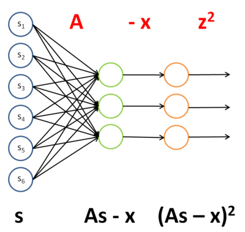
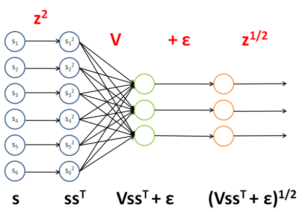

## 用反向传导思想求导（Deriving gradients using the backpropagation idea）

注：本章节翻译参考旧版 UFLDL 中文教程。

>译者注：本文更多的是一种思想，应用反向传播算法更新参数的思想，用在一般的函数的求导问题上。不仅看起来清晰，理解起来也透彻。这也从侧面体现神经网络可以表示复杂函数的能力，反之亦然。

### 1. 简介（Introduction）

在 [多层神经网络-反向传导算法](./监督神经网络（Supervised Neural Networks）/多层神经网络（Multi-Layer Neural Networks）.md) 一节中，介绍了在稀疏自编码器中用反向传导算法来求梯度的方法。事实证明，反向传导算法与矩阵运算相结合的方法，对于计算复杂矩阵函数（从矩阵到实数的函数，或用符号表示为：从 $\mathbb{R}^{r \times c} \rightarrow \mathbb{R}$ ）的梯度是十分强大和直观的。

首先，回顾一下反向传导的思想，为了更适合目的，将其稍作修改呈现于下：

1. 对第 $n_l$ 层（最后一层）中的每一个输出单元 $i$ ，令
$$
\delta^{(n_l)}_i = \frac{\partial}{\partial z^{(n_l)}_i} \;\; J(z^{(n_l)})
$$
其中， $J(z)$ 是“目标函数”（稍后解释）。
对 $l = n_l-1, n_l-2, n_l-3, \ldots, 2 $,

2. 对第 $l$ 层中的每个节点 $i$ ，令
$$
\delta^{(l)}_i = \left( \sum_{j=1}^{s_{l+1}} W^{(l)}_{ji} \delta^{(l+1)}_j \right) \bullet \frac{\partial}{\partial z^{(l)}_i} f^{(l)} (z^{(l)}_i)
$$
3. 计算需要的偏导数
$$\begin{align}
\nabla_{W^{(l)}} J(W,b;x,y) &= \delta^{(l+1)} (a^{(l)})^T, \\
\end{align}$$

符号简要说明：

|符号 |说明 |
| :------------: |---------------------------------------|
| $l$            | 是神经网络的层数|
| $n_l$          | 第 $l$ 层神经元的个数|
| $W^{(l)}_{ji}$ |是 $l$ 层第 $i$ 个节点到第 $(l + 1)$ 层第 $j$ 个节点的权重|
| $z^{(l)}_i$    |是第 $l$ 层第 $i$ 个单元（即节点）的输入|
| $a^{(l)}_i$    |是第 $l$ 层第 $i$ 个节点的激励|
| $A \bullet B$  |是矩阵的 Hadamard 积或逐个元素乘积，对 $r \times c$ 矩阵 $A$ 和 $B$ ，它们的乘积是 $r \times c$ 矩阵 $C = A \bullet B$ ，即 $C_{r, c} = A_{r, c} \cdot B_{r, c}$ |
| $f(l)$         | 是第 $l$ 层中各单元的激励函数 |

>**Hadamard 乘积**
>
>矩阵 $A,B$ 的 Hadamard 乘积定义为二者对应位置的乘积。
>设相同维度的矩阵（ $A,B$ 矩阵均为 $m$ 行 $n$ 列 ），其中， $A=(a_{i,j}) (m×n),B=(b_{i,j}) (m×n)$ ，则二者的 Hadamard 乘积为 $C=(a_{i,j} \times b_{i,j}) (m×n).$

假设有一个函数 $F$ ， $F$ 以矩阵 $X$ 为参数生成一个实数。我们希望用反向传导思想计算 $F$ 关于 $X$ 的梯度，即 $\nabla_X F$ 。大致思路是将函数 $F$ 看成一个多层神经网络，并使用反向传导思想求梯度。

为了实现这个想法，取目标函数为 $J(z)$ ，当计算最后一层神经元的输出时，会产生值 $F(X)$ 。对于中间层，将选择激励函数 $f(l)$ 。

稍后会看到使用这种方法，可以很容易计算出对于输入 $X$ 以及网络中任意一个权重的导数。

### 2. 示例（Examples）

为了阐述如何使用反向传导思想计算关于输入的导数，在示例 1 ，示例 2 中用 [稀疏编码](./稀疏编码（Sparse Coding）.md) 章节中的两个函数。在示例 3 中，使用 [独立成分分析](./独立成分分析（ICA）.md) 一节中的一个函数来说明使用此思想计算关于权重的偏导的方法，以及在这种特殊情况下，如何处理相互捆绑或重复的权重。

#### 2.1 示例1：稀疏编码中权重矩阵的目标函数（Example 1: Objective for weight matrix in sparse coding）

回顾一下 [稀疏编码自编码表达](./稀疏编码自编码表达（Sparse Coding: Autoencoder Interpretation）.md) ，当给定特征集矩阵 $s$ 时，权重矩阵 $A$ （译者注：在该章节中， $A$ 为基向量）的目标函数为：

$$
F(A; s) = \lVert As - x \rVert_2^2 + \gamma \lVert A \rVert_2^2
$$

我们希望求 $F$ 对于基向量 $A$ 的梯度，即 $\nabla_A F(A)$ 。因为目标函数是两个含 $A$ 的式子之和，所以它的梯度是每个式子的梯度之和。第二项的梯度很容易求，因此我们只考虑第一项的梯度。

第一项， $\lVert As - x \rVert_2^2$ ，可以看成一个用特征集矩阵 $s$ 做输入的神经网络的实例，通过四步进行计算，文字以及图形描述如下：

1. 把 $A$ 作为第一层到第二层的权重。
2. 将第二层的激励减 $x$ ，第二层使用了单位激励函数。
3. 通过单位权重将结果不变地传到第三层。在第三层使用平方函数作为激励函数。
4. 将第三层的所有激励相加。

该网络的权重和激励函数如下表所示：

|层|权重|激励函数 $f$ |
|:-:|:-:|:-:|
|1|	$A$ | $f(z_i) = z_i$ （单位函数）|
|2|	$I$ （单位向量）|	$f(z_i) = z_i − x_i$|
|3|	$N/A$ | $f(z_i) = z_i^2$ |

为了使 $J(z^{(3)}) = F(x)$ ，可令 $J(z^{(3)}) = \sum_k J(z^{(3)}_k)$ 。

一旦将 $F$ 看成神经网络，梯度 $\nabla_X F$ 就很容易求了——使用反向传导得到：

|层|激励函数的导数$f'$| Delta | 该层输入 $z$ |
|:-:|:-:|:-:|:-:|
|3|	$f'(z_i) = 2z_i$ | $f'(z_i) = 2z_i$ | $As − x$ |
|2| $f'(z_i) = 1$ | $\left( I^T \delta^{(3)} \right) \bullet 1$ | $As$ |
|1|	$f'(z_i) = 1$ |	$\left( A^T \delta^{(2)} \right) \bullet 1$ | $s$ |

因此

$$
\begin{align}
\nabla_X F & = A^T I^T 2(As - x) \\
& = A^T 2(As - x)
\end{align}
$$

>译者注：从形式看，是从第一层（ $i=2$ ）开始逐层向上使用 $\delta ^{(i)}$ 替换 delta ，直到最后一层，将 $z_{i}$ 替换为最后一层的输入。然后再化简得到其最简形式（示例 2 和 3 与此类似）。

#### 2.2 示例2：稀疏编码中的经过平滑的L1稀疏惩罚项（Example 2: Smoothed topographic L1 sparsity penalty in sparse coding）

回顾 [稀疏编码自编码表达](./稀疏编码自编码表达（Sparse Coding: Autoencoder Interpretation）.md) 一节中对特征集矩阵 $s$ 经过平滑的 $L1$ 稀疏惩罚项：

$$
\sum{ \sqrt{Vss^T + \epsilon} }
$$

其中 $V$ 是分组矩阵， $s$ 是特征集矩阵， $\epsilon$ 是一个常数。
>* $\epsilon$ 一般称为“平滑参数”（ "smoothing parameter" ）或者“稀疏参数”（ "sparsity parameter" ）。其存在是用来解决目标函数的 $L1$ 范数在 $0$ 点处不可微问题（该问题影响了梯度方法的应用）。
>尽管可以通过其他非梯度下降方法避开这一问题，但是本文通过使用近似值“平滑” $L1$ 范数的方法解决此难题。

>* 稀疏编码目标函数的一种形式是：
$$
J(A, s) = \lVert As - x \rVert_2^2 + \lambda \sqrt{s^2 + \epsilon} + \gamma \lVert A \rVert_2^2
$$
其中，稀疏惩罚项由原本的 $\lambda \lVert s \rVert_1$ 经平滑变为 $\sqrt{s^2 + \epsilon}$ 。 $\sqrt{s^2 + \epsilon}$ 是 $\sum_k{\sqrt{s_k^2 + \epsilon}}$ 的简写。

>* 分组矩阵 $V$ 。“分组”可以通过“分组矩阵” $V$ 完成，分组矩阵 $V$ 的第 $r$ 行标识了哪些特征被分到第 $r$ 组中，即如果第 $r$ 组包含特征 $c$ 则 $V_{r,c} = 1$ 。**通过分组矩阵实现分组使得梯度的计算更加直观。**
>**拓扑稀疏编码得到的特征与稀疏编码得到的类似，只是拓扑稀疏编码得到的特征是以某种方式有“秩序”排列的。**这个“秩序”就提现在分组矩阵 $V$ 上。

我们希望求得 $\nabla_s \sum{ \sqrt{Vss^T + \epsilon} }$ 。像上面那样，把这一项看做一个神经网络的实例：

该网络的权重和激励函数如下表所示：

|层|权重|激励函数 $f$ |
|:-:|:-:|:-:|
|1| $I$ （单位向量） | $f(z_i) = z_i^2$ |
|2|	$V$ | $f(z_i) = z_i$ |
|3| $I$ （单位向量） | $f(z_i) = z_i + \epsilon$ |
|4|	$N/A$ | $f(z_i) = z_i^{\frac{1}{2}}$ |

为使 $J(z^{(4)}) = F(x)$ ，可令 $J(z^{(4)}) = \sum_k J(z^{(4)}_k)$ 。

一旦把 $F$ 看做一个神经网络，梯度 $\nabla_X F$ 变得很容易计算——使用反向传导得到：

|层|激励函数的导数 $f'$ | Delta	| 该层输入 $z$ |
|:-:|:-:|:-:|:-:|
|4|	$f'(z_i) = \frac{1}{2} z_i^{-\frac{1}{2}}$ | $f'(z_i) = \frac{1}{2} z_i^{-\frac{1}{2}} $ | $ (Vss^T + \epsilon)$|
|3| $f'(z_i) = 1$ | $\left( I^T \delta^{(4)} \right) \bullet 1$ | $Vss^T$ |
|2|	$f'(z_i) = 1$ | $\left( V^T \delta^{(3)} \right) \bullet 1$ | $ss^T$ |
|1|	$f'(z_i) = 2z_i$ | $\left( I^T \delta^{(2)} \right) \bullet 2s$ | $s$ |

因此

$$
\begin{align}
\nabla_X F & = I^T V^T I^T \frac{1}{2}(Vss^T + \epsilon)^{-\frac{1}{2}} \bullet 2s \\
& = V^T \frac{1}{2}(Vss^T + \epsilon)^{-\frac{1}{2}} \bullet 2s \\
& = V^T (Vss^T + \epsilon)^{-\frac{1}{2}} \bullet s
\end{align}
$$

#### 2.3 示例3：ICA重建代价（Example 3: ICA reconstruction cost）

回顾 [独立成分分析（ ICA ）](./独立成分分析（ICA）.md) 一节重建代价一项： $\lVert W^TWx - x \rVert_2^2$ ，其中 $W$ 是权重矩阵， $x$ 是输入。

我们希望计算 $\nabla_W \lVert W^TWx - x \rVert_2^2$ ——对于权重矩阵 $W$ 的导数，而不是像前两例中对于输入 $x$ 的导数。不过我们仍然用类似的方法处理，把该项看做一个神经网络的实例：

该网络的权重和激励函数如下表所示：

|层|权重|激励函数 $f$|
|:----:|:----:|:--:|
|1| $W$| $f(z_i) = z_i$|
|2| $W^T$| $f(z_i) = z_i$|
|3| $I$ （单位向量） | $f(z_i) = z_i − x_i$|
|4| $N/A$| $f(z_i) = z_i^2$|

为使 $J(z^{(4)}) = F(x)$ ，可令 $J(z^{(4)}) = \sum_k J(z^{(4)}_k)$ 。

既然可将 $F$ 看做神经网络，那么就能计算出梯度 $\nabla_W F$ 。然而，**现在面临的难题是 $W$ 在网络中出现了两次**。幸运的是，可以证明如果 $W$ 在网络中出现多次，那么对于 $W$ 的梯度是对网络中每个 $W$ 实例的梯度的简单相加（您需要自己给出对这一事实的严格证明来说服自己）。知道这一点后，首先将计算 delta ：

|层|	激励函数的导数 $f'$| $Delta$| 该层输入 $z$|
|:-:|:-:|:-:|
|4|	$f'(z_i) = 2z_i$|	$f'(z_i) = 2z_i$| $(W^TWx − x)$|
|3| $f'(z_i) = 1$| $\left( I^T \delta^{(4)} \right) \bullet 1$ | $W^TWx$|
|2| $f'(z_i) = 1$| $\left( (W^T)^T \delta^{(3)} \right) \bullet 1$ | $Wx$ |
|1|	$f'(z_i) = 1$| $\left( W^T \delta^{(2)} \right) \bullet 1$ | $x$|

（ $W$ 在网络中出现了两次）为计算对于 $W$ 的梯度，首先计算对网络中每个 $W$ 实例的梯度。

对于 $W^T$ ：

$$
\begin{align}
\nabla_{W^T} F & = \delta^{(3)} a^{(2)T} \\
& = 2(W^TWx - x) (Wx)^T
\end{align}
$$

对于 $W$ ：

$$
\begin{align}
\nabla_{W} F & = \delta^{(2)} a^{(1)T} \\
& = (W^T)(2(W^TWx -x)) x^T
\end{align}
$$

最后进行求和，得到对于 $W$ 的最终梯度，注意需要对 $W^T$ 梯度进行转置，来得到关于 $W$ 的梯度（原谅我在这里稍稍滥用了符号）：

$$
\begin{align}
\nabla_{W} F & = \nabla_{W} F + (\nabla_{W^T} F)^T \\ & = (W^T)(2(W^TWx -x)) x^T + 2(Wx)(W^TWx - x)^T
\end{align}
$$