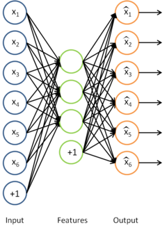

## 稀疏编码自编码表达（Sparse Coding: Autoencoder Interpretation）

注：本文参考旧版 UFLDL 中文翻译。  

### 稀疏编码（Sparse coding）

>稀疏编码是一种模拟哺乳动物视觉系统主视皮层 V1 区简单细胞感受野的人工神经网络方法。该方法具有空间的局部性、方向性和频域的带通性，是一种自适应的图像统计方法。

稀疏自编码算法，试着学习得到一组权重参数 $W$ 以及相应的截距 $b$ ，通过这些参数可以得到稀疏特征向量 $σ(Wx + b)$ ，这些特征向量对于重构输入样本非常有用。

稀疏编码可以看作是稀疏自编码方法的一个变形，该方法试图直接学习数据 $x$ 的特征集 $s$ 。利用与此特征集相应的基向量 $A$ ，将学习得到的特征集 $s$ 从特征空间转换到样本数据 $x$ 的空间，这样就可以用学习得到的（译者注：所在的样本空间的）特征集 $As$ 重构样本数据 $x$ 。

确切地说，在稀疏编码算法中，有样本数据 $x$ 供特征学习。**特别是，学习一个用于表示样本数据 $x$ 的稀疏特征集 $s$ ，和一个将特征集从特征空间转换到样本数据空间的基向量 $A$ ，可以构建如下目标函数**：

$$
J(A, s) = \lVert As - x \rVert_2^2 + \lambda \lVert s \rVert_1
$$

其中， $\lVert x \rVert_k$ 是 $x$ 的 $Lk$ 范数，等价于 $\left( \sum{ \left| x_i^k \right| } \right) ^{\frac{1}{k}}$ 。 $L2$ 范数即大家熟知的欧几里得范数， $L1$ 范数是向量元素的绝对值之和。

上式第一部分 $\lVert As - x \rVert_2^2$ 是利用基向量 $A$ 将特征集 $s$ 重构为样本数据（译者注：的空间时与原样本间）所产生的误差，第二部分 $\lambda \lVert s \rVert_1$ 为稀疏性惩罚项（ sparsity penalty term ），用于保证特征集 $s$ 的稀疏性。

但是，如目标函数所示，它（译者注：即第一项的 $L2$ 范数）的约束性并不强――按常数比例缩放 $A$ 的同时再按这个常数的倒数缩放 $s$ （译者注：因为 $As$ 是重构出的与 $x$ 同空间的样本数据， $A$ 与 $s$ 的关系是此消彼长），（译者注： $A$ 过大）结果不会改变误差大小，却会减少稀疏代价项（即 $\lambda \lVert s \rVert_1$ ）的值。因此，需要为 $A$ 中每项 $A_j$ 增加额外约束 $A_j^TA_j \le 1$ 。问题变为：

$$
\begin{array}{rcl}
     {\rm minimize} & \lVert As - x \rVert_2^2 + \lambda \lVert s \rVert_1 \\
     {\rm s.t.}     &    A_j^TA_j \le 1 \; \forall j \\
\end{array} 
$$

遗憾的是，因为目标函数并不是一个凸函数（译者注：两个变量 $A$ 和 $s$ 存在乘积项，此外 $A$ 有约束限制 $A_j^TA_j \le 1 \; \forall j$ ），所以不能用梯度方法解决这个优化问题。但是，在给定 $A$ 的情况下，最小化 $J(A,s)$ 求解 $s$ 是凸的。同理，给定 $s$ 最小化 $J(A,s)$ 求解 $A$ 也是凸的。这表明，可以通过交替固定 $s$ 和 $A$ 分别求解 $A$ 和 $s$ 。实践表明，这一策略取得的效果非常好。

但是，以上表达式带来了另一个难题：不能用简单的梯度方法来实现约束条件 $A_j^TA_j \le 1 \; \forall j$ 。在实际问题中，此约束条件被削弱成一个（译者注：旧版译文此处有错）“权重衰变”（ "weight decay" ）项（译者注：前文 [多层神经网络](../监督神经网络（Supervised Neural Networks）/多层神经网络（Multi-Layer Neural Networks）.md) 一节中出现过 **权重衰减** ，即目标函数 $J(W,b)$ 中的正则化项 $\frac{\lambda}{2} \sum_{l=1}^{n_l-1} \; \sum_{i=1}^{s_l} \; \sum_{j=1}^{s_{l+1}} \left( W^{(l)}_{ji} \right)^2$ ）以保证 $A$ 的每一项值够小。这样我们就得到一个新的目标函数：

$$
J(A, s) = \lVert As - x \rVert_2^2 + \lambda \lVert s \rVert_1 + \gamma \lVert A \rVert_2^2
$$

注意上式中的第三项 $\lVert A \rVert_2^2$ ，等价于 $\sum_r{\sum_c{A_{rc}^2}}$ ，是 $A$ 中各项的平方和。

这一目标函数带来了最后一个问题，即 $L1$ 范数在 $0$ 点处不可微影响了梯度方法的应用。尽管可以通过其他非梯度下降方法避开这一问题，但是本文通过使用近似值“平滑” $L1$ 范数的方法解决此难题。使用 $\sqrt{x^2 + \epsilon}$ 代替 $\left| x \right|$ ，对 $L1$ 范数进行平滑，其中 $ε$ 是“平滑参数”（ "smoothing parameter" ）或者“稀疏参数”（ "sparsity parameter" ）。

>**绝对值函数 $y=|x|$ 在 $x=0$ 处不可微的原因**：
>因为 $x \leq 0$ 时 $y=-x$ ，其在 $x=0$ 处的左导数 $y'=-1$ ； $x \geq 0$ 时 $y=x$ ，其在 $x=0$ 处的右导数 $y'=1$ 。
>即函数 $y=∣x∣$ 在 $x=0$ 处的左右导数都存在但不相等，故在 $x=0$ 处的导数不存在，即不可导。也就是所谓的**不可微**。

如果平滑参数 $\epsilon$ 远大于 $x$ （译者注：这里 $x$ 没有特指样本数据，下面紧接着所讲的目标函数中的 $s^2$ 相当于这里的 $x$ ），则 $x + \epsilon$ 的值将由平滑参数 $\epsilon$ 主导，其平方根近似于 $\sqrt{\epsilon}$ 。在下文提及拓扑稀疏编码时，“平滑”会派上用场。

因此，最终的目标函数是：

$$
J(A, s) = \lVert As - x \rVert_2^2 + \lambda \sqrt{s^2 + \epsilon} + \gamma \lVert A \rVert_2^2
$$

其中，稀疏惩罚项由原本的 $\lambda \lVert s \rVert_1$ 经平滑变为 $\sqrt{s^2 + \epsilon}$ 。 $\sqrt{s^2 + \epsilon}$ 是 $\sum_k{\sqrt{s_k^2 + \epsilon}}$ 的简写。

该目标函数可以通过以下过程迭代优化：

1. 随机初始化基向量 $A$
2. 重复以下步骤直至收敛：
   1. 根据上一步给定的基向量 $A$ ，求解能够最小化 $J(A,s)$ 的 $s$
   2. 根据上一步得到的特征集 $s$ ，求解能够最小化 $J(A,s)$ 的 $A$

观察修改后的目标函数 $J(A,s)$ ，给定特征集 $s$ 的条件下，目标函数可以简化为 $J(A; s) = \lVert As - x \rVert_2^2 + \gamma \lVert A \rVert_2^2$（因为特征集 $s$ 的 $L1$ 范式不是基向量 $A$ 的函数， $\sqrt{s^2 + \epsilon}$ 是一个常数，所以简化中可以忽略）。简化后的目标函数是一个关于 $A$ 的简单二次多项式，因此对 $A$ 求导是很容易的。这种求导的一种快捷方法是矩阵微积分（ [这里](../预备知识（Miscellaneous ）/预备知识推荐（Useful Links）.md) 给出了矩阵运算相关的内容）。遗憾的是，在给定基向量 $A$ 的条件下，目标函数却不具备这样的求导方法，因此目标函数的最小化步骤只能用梯度下降或其他类似的最优化方法。

>目标函数却不具备矩阵微积分的求导方法

理论上，通过上述迭代方法求解目标函数的最优化问题最终得到的特征集（ $A$ 的基向量）与通过稀疏自编码学习得到的特征集是差不多的。但是实际上，为了获得更好的算法收敛性需要使用一些小技巧，后面的 [练习：稀疏编码（Exercise:Sparse Coding）](../无监督学习（Unsupervised Learning）/练习：稀疏编码（Exercise:Sparse Coding）.md) 小节会详细介绍这些技巧。用梯度下降方法求解目标函数也略需技巧，另外使用矩阵运算或反向传播算法则有助于解决此类问题。

### 拓扑稀疏编码（Topographic sparse coding）

通过稀疏编码，我们能够得到一组用于表示样本数据的特征集。不过，让我们来找些灵感，我们希望学习得到一组有某种“秩序”的特征集。举个例子，视觉特征，如前面所提到的，大脑皮层 V1 区神经元能够按特定的方向对边缘进行检测，同时，这些神经元（在生理上）被组织成超柱（ hypercolumns ），在超柱中，相邻神经元以相似的方向对边缘进行检测，一个神经元检测水平边缘，其相邻神经元检测到的边缘就稍微偏离水平方向，沿着超柱，神经元就可以检测到与水平方向相差更大的边缘了。

受该例子的启发，我们希望学习到的特征也具有这样“拓扑秩序”的性质。这对于我们要学习的特征意味着什么呢？直观的讲，如果“相邻”的特征是“相似”的，就意味着如果某个特征被激活，那么与之相邻的特征也将随之被激活。

具体而言，假设我们（随意地）将特征组织成一个方阵。我们就希望矩阵中相邻的特征是相似的。实现这一点的方法是将相邻特征按经过平滑的L1范式惩罚进行分组，如果按 $3 \times 3$ 方阵分组，则用 $\sqrt{s_{1,1}^2 + s_{1,2}^2 + s_{1,3}^2 + s_{2,1}^2 + s_{2,2}^2 + s_{3,2}^2 + s_{3,1}^2 + s_{3,2}^2 + s_{3,3}^2 + \epsilon}$ 代替 $\sqrt{s_{1,1}^2 + \epsilon}$ ，其分组通常是重合的，因此从第 $1$ 行第 $1$ 列开始的 $3 \times 3$ 区域是一个分组，从第 $1$ 行第 $2$ 列开始的 $3 \times 3$ 区域是另一个分组，以此类推。最终，这样的分组会形成环绕，就好像这个矩阵是个环形曲面，所以每个特征都以同样的次数进行了分组。 于是，将经过平滑的所有分组的 $L1$ 惩罚值之和代替经过平滑的 $L1$ 惩罚值，得到新的目标函数如下：

$$
J(A, s) = \lVert As - x \rVert_2^2 + \lambda \sum_{\text{all groups } g}{\sqrt{ \left( \sum_{\text{all } s \in g}{s^2} \right) + \epsilon} } + \gamma \lVert A \rVert_2^2
$$

实际上，“分组”可以通过“分组矩阵” $V$ 完成，于是矩阵 $V$ 的第 $r$ 行标识了哪些特征被分到第 $r$ 组中，即如果第 $r$ 组包含特征 $c$ 则 $Vr,c = 1$ 。通过分组矩阵实现分组使得梯度的计算更加直观，使用此分组矩阵，目标函数被重写为：

$$
J(A, s) = \lVert As - x \rVert_2^2 + \lambda \sum{ \sqrt{Vss^T + \epsilon} } + \gamma \lVert A \rVert_2^2
$$

(令 $D = \sqrt{Vss^T + \epsilon}，\sum{ \sqrt{Vss^T + \epsilon} }$ 等价于
$∑	∑	Dr,c
r	c	$
)

该目标函数能够使用之前部分提到的迭代方法进行求解。拓扑稀疏编码得到的特征与稀疏编码得到的类似，只是拓扑稀疏编码得到的特征是以某种方式有“秩序”排列的。

### 稀疏编码实践（Sparse coding in practice）

如上所述，虽然稀疏编码背后的理论十分简单，但是要写出准确无误的实现代码并能快速又恰到好处地收敛到最优值，则需要一定的技巧。

回顾一下之前提到的简单迭代算法：

1. 随机初始化 $A$
2. 重复以下步骤直至收敛到最优值：
  1. 根据上一步给定的 $A$ ，求解能够最小化 $J(A,s)$ 的 $s$
  2. 根据上一步得到的 $s$ ，求解能够最小化 $J(A,s)$ 的 $A$

这样信手拈来地执行这个算法，结果并不会令人满意，即使确实得到了某些结果。以下是两种更快更优化的收敛技巧：

1. 将样本分批为“迷你块”
2. 良好的 $s$ 初始值

#### 将样本分批为“迷你块”（Batching examples into mini-batches）

如果你一次性在大规模数据集（比如，有 $10000$ 个 patch ）上执行简单的迭代算法，你会发现每次迭代都要花很长时间，也因此这算法要花好长时间才能达到收敛结果。为了提高收敛速度，可以选择在迷你块上运行该算法。每次迭代的时候，不是在所有的 $10000$ 个 patchs 上执行该算法，而是使用迷你块，即从 $10000$ 个 patch 中随机选出 $2000$ 个 patch ，再在这个迷你块上执行这个算法。这样就可以做到一石二鸟――第一，提高了每次迭代的速度，因为现在每次迭代只在 $2000$ 个 patch 上执行而不是 $10000$ 个；第二，也是更重要的，它提高了收敛的速度（原因见TODO）。

#### 良好的 $s$ 初始值（Good initialization of $s$ ）

另一个能获得更快速更优化收敛的重要技巧是：在给定 $A$ 的条件下，根据目标函数使用梯度下降（或其他方法）求解 $s$ 之前找到良好的特征矩阵 $s$ 的初始值。实际上，除非在优化 $A$ 的最优值前已找到一个最佳矩阵 $s$ ，不然每次迭代过程中随机初始化 $s$ 值会导致很差的收敛效果。下面给出一个初始化 $s$ 的较好方法：

1. 令 $s \leftarrow W^Tx$ ( $x$ 是迷你块中 patches 的矩阵表示)
2. $s$ 中的每个特征（ $s$ 的每一列），除以其在 $A$ 中对应基向量的范数。即，如果 $sr,c$ 表示第 $c$ 个样本的第 $r$ 个特征，则 $Ac$ 表示 $A$ 中的第 $c$ 个基向量，则令 $s_{r, c} \leftarrow \frac{ s_{r, c} } { \lVert A_c \rVert }.$

无疑，这样的初始化有助于算法的改进，因为上述的第一步希望找到满足 $Ws \approx x$ 的矩阵 $s$ ；第二步对 $s$ 作规范化处理是为了保持较小的稀疏惩罚值。这也表明，只采用上述步骤的某一步而不是两步对 $s$ 做初始化处理将严重影响算法性能。（TODO: 此链接将会对为什么这样的初始化能改进算法作出更详细的解释）

#### 可运行算法（The practical algorithm）

有了以上两种技巧，稀疏编码算法修改如下：

1. 随机初始化 $A$
2. 重复以下步骤直至收敛
   1. 随机选取一个有 $2000$ 个 patches 的迷你块
   2. 如上所述，初始化 $s$
   3. 根据上一步给定的 $A$ ，求解能够最小化 $J(A,s)$ 的 $s$
   4. 根据上一步得到的 $s$ ，求解能够最小化 $J(A,s)$ 的 $A$

通过上述方法，可以相对快速的得到局部最优解。