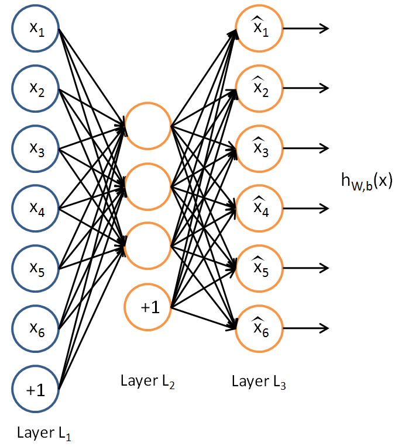
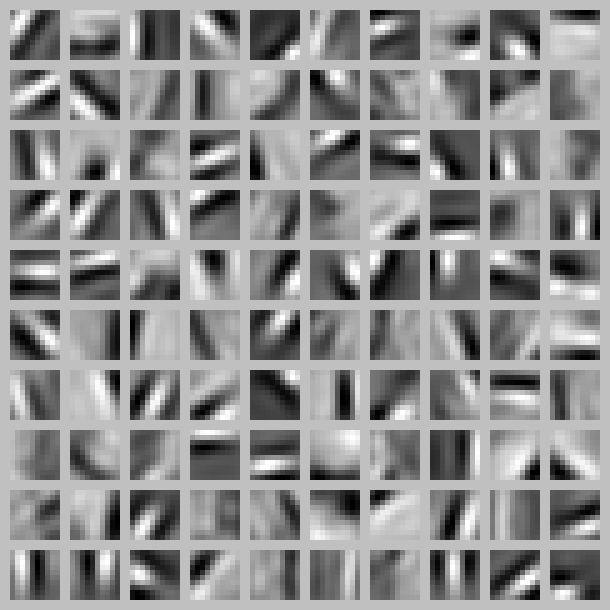

## 自动编码器（Autoencoders）  
注：本文大量参考旧版 UFLDL 中文翻译。  

迄今为止，已经讲了神经网络在有监督学习方面的的应用。在有监督学习中，训练样本是有标签的。现在假设有一组无标签的训练样本 $\textstyle \{x^{(1)}, x^{(2)}, x^{(3)}, \ldots\}$ ，其中 $\textstyle x^{(i)} \in \Re^{n}$ 。自动编码器神经网络（译者注：或称为“自动编码器”）是一个基于反向传播的无监督学习算法，其中设定目标值与输入值相等： $\textstyle y^{(i)} = x^{(i)}$ 。  

下面是一个自动编码器的示意图：  

  

自动编码器尝试学习一个 $\textstyle h_{W,b}(x) \approx x$ 函数。换句话说，它尝试逼近一个恒等函数，从而使得输出 $\textstyle \hat{x}$ 接近输入 $\textstyle x$ 。恒等函数虽然看上去不太有学习的意义，但是当给自编码神经网络加入某些限制，比如限定隐藏神经元的数量，就可以从输入数据中发现一些有趣的结构。举例来说，假设某个自动编码器的输入 $\textstyle x$ 是一张分辨率大小为 $\textstyle 10 \times 10$ 图像（共 $100$ 个像素）的像素灰度值，即 $\textstyle n=100$ ，其隐藏层 $\textstyle L_2$ 中有 $50$ 个隐藏神经元。注意，输出也是 $100$ 维的 $\textstyle y \in \Re^{100}$ 。由于只有 $50$ 个隐藏神经元，我们迫使自编码神经网络去学习输入数据的压缩表示，也就是说，它必须从 $50$ 维的隐藏神经元激活度向量 $\textstyle a^{(2)} \in \Re^{50}$ 中重构出 $100$ 维的像素灰度值输入 $\textstyle x$ 。如果网络的输入数据是完全随机的，比如每一个输入 $\textstyle x_i$ 都是一个跟其它特征完全无关的独立同分布高斯随机变量，那么这一压缩表示将会非常难学习。但是如果输入数据中隐含着一些特定的结构，比如某些输入特征是彼此相关的，那么这一算法就可以发现输入数据中的这些相关性。事实上，这一简单的自动编码器通常可以学习出一个跟主成分分析（PCA）结果非常相似的输入数据的低维表示。  

以上论述是基于隐藏神经元数量较小的假设。但即使隐藏神经元的数量较大（可能比输入像素的个数还要多），仍可通过给自动编码器施加一些其他的限制条件来发现输入数据中有趣的结构。具体来说，如果给隐藏神经元加入稀疏性限制，自动编码器即使在隐藏神经元数量较多的情况下仍然可以发现输入数据中一些有趣的结构。  

稀疏性可以被简单地解释如下。如果当神经元的输出接近于 $1$ 的时候认为它被激活，而输出接近于 $0$ 的时候认为它被抑制，那么使得神经元大部分的时间都是被抑制的限制则被称作稀疏性限制。这里假设神经元的激活函数是 $sigmoid$ 函数。如果使用 $tanh$ 作为激活函数，当神经元输出为 $-1$ 的时，认为神经元是被抑制的。  

注意到 $\textstyle a^{(2)}_j$ 表示网络第二层的隐藏神经元 $\textstyle j$ 的激活值，但该表示方法中并未明确指出哪一个输入 $\textstyle x$ 带来了这一激活值。所以改用 $\textstyle a^{(2)}_j(x)$ 来表示在给定输入为 $\textstyle x$ 情况下，自动编码器的隐藏神经元 $\textstyle j$ 的激活值。  

进一步，让 
$$
\begin{align} \hat\rho_j = \frac{1}{m} \sum_{i=1}^m \left[ a^{(2)}_j(x^{(i)}) \right] \end{align} 
$$

表示隐藏神经元 $\textstyle j$ 的平均活跃度（在训练集上取平均）。可以近似的加入一条限制  

$$
\begin{align} \hat\rho_j = \rho, \end{align}
$$

其中， $\textstyle \rho$ 是稀疏性参数，通常是一个接近于0的较小的值（比如 $\textstyle \rho = 0.05$ ）。换句话说，想要让隐藏神经元 $\textstyle j$ 的平均活跃度接近 $0.05$ 。为了满足这一条件，隐藏神经元的活跃度必须接近于 $0$ 。

为了实现这一限制，将会在优化目标函数中加入一个额外的惩罚因子，而这一惩罚因子将惩罚那些 $\textstyle \hat\rho_j$ 和 $\textstyle \rho$ 有显著不同的情况从而使得隐藏神经元的平均活跃度保持在较小范围内。惩罚因子的具体形式有很多种合理的选择，我们将会选择以下这一种： 

$$
\begin{align} \sum_{j=1}^{s_2} \rho \log \frac{\rho}{\hat\rho_j} + (1-\rho) \log \frac{1-\rho}{1-\hat\rho_j}. \end{align} 
$$

这里， $\textstyle s_2$ 是隐藏层中隐藏神经元的数量，而索引 $\textstyle j$ 依次代表隐藏层中的每一个神经元。如果您对相对熵（ $Kullback–Leibler\ divergence$ ，也称“信息增益”）比较熟悉，这一惩罚因子实际上是基于它的。于是惩罚因子也可以被表示为

$$
\begin{align} \sum_{j=1}^{s_2} {\rm KL}(\rho || \hat\rho_j), \end{align} 
$$

其中 $\textstyle {\rm KL}(\rho || \hat\rho_j) = \rho \log \frac{\rho}{\hat\rho_j} + (1-\rho) \log \frac{1-\rho}{1-\hat\rho_j}$ 是一个以 $\textstyle \rho$ 为均值和一个以 $\textstyle \hat\rho_j$ 为均值的两个伯努利随机变量之间的相对熵。相对熵是一种标准的用来测量两个分布之间差异的方法。（如果您不了解相对熵，不用担心，所有您需要知道的内容都在这份笔记之中。）

>伯努利随机分布：一个离散型概率分布，是二项分布的特殊情况。伯努利分布是一种离散分布，有两种可能的结果： $1$ 表示成功，出现的概率为 $p$ ，其中 $0 < p < 1$ ， $0$ 表示失败，出现的概率为 $q=1-p$。其分布率为：  
>$$ f(x)=\left\{
\begin{aligned}
& 1-p & n=0 \\
& p   & n-1
\end{aligned}
\right.
$$

这一惩罚因子有如下性质，当 $\textstyle \hat\rho_j = \rho$ 时 $\textstyle {\rm KL}(\rho || \hat\rho_j) = 0$ ，并且随着 $\textstyle \hat\rho_j$ 与 $\textstyle \rho$ 之间的差异增大而单调递增。举例来说，在下图中，设定 $\textstyle \rho = 0.2$ 并且画出了相对熵值 $\textstyle {\rm KL}(\rho || \hat\rho_j)$ 随着 $\textstyle \hat\rho_j$ 变化的变化。 

  

可以看出，相对熵在 $\textstyle \hat\rho_j = \rho$ 时达到它的最小值 $0$ ，而当 $\textstyle \hat\rho_j$ 靠近 $0$ 或者 $1$ 的时候，相对熵则变得非常大（其实是趋向于 $\textstyle \infty$ ）。所以，最小化这一惩罚因子具有使得 $\textstyle \hat\rho_j$ 靠近 $\textstyle \rho$ 的效果。  

现在，总体代价函数可以表示为  

$$
\begin{align} J_{\rm sparse}(W,b) = J(W,b) + \beta \sum_{j=1}^{s_2} {\rm KL}(\rho || \hat\rho_j), \end{align} 
$$

其中 $\textstyle J(W,b)$ 如之前所定义，而 $\textstyle \beta$ 控制稀疏性惩罚因子的权重。 $\textstyle \hat\rho_j$ 项则也（间接地）取决于 $\textstyle W,b$ ，因为它是隐藏神经元 $\textstyle j$ 的平均激活度，而隐藏层神经元的激活度取决于 $\textstyle W,b$ 。

为了对相对熵进行导数计算，可以使用一个易于实现的技巧，这只需要在您的程序中稍作改动即可。具体来说，前面在后向传播算法中计算第二层（ $\textstyle l=2$ ）更新的时候已经计算了  

$$
\begin{align} \delta^{(2)}_i = \left( \sum_{j=1}^{s_{2}} W^{(2)}_{ji} \delta^{(3)}_j \right) f'(z^{(2)}_i), \end{align} 
$$

现在将其换成

$$
\begin{align} 
\delta^{(2)}_i = \left( \left( \sum_{j=1}^{s_{2}} W^{(2)}_{ji} \delta^{(3)}_j \right) + \beta \left( - \frac{\rho}{\hat\rho_i} + \frac{1-\rho}{1-\hat\rho_i} \right) \right) f'(z^{(2)}_i). 
\end{align} 
$$  

>译者：怀疑上述公式的稀疏项与前文中描述的不符合，怀疑是否写错了。

就可以了。

有一个需要注意的地方就是需要知道 $\textstyle \hat\rho_i$ 来计算这一项更新。所以在计算任何神经元的后向传播之前，您需要对所有的训练样本计算一遍前向传播，从而获取平均激活度。如果您的训练样本可以小到被整个存到内存之中（对于编程作业来说，通常如此），您可以方便地在您所有的样本上计算前向传播并将得到的激活度存入内存并且计算平均激活度 。然后您就可以使用事先计算好的激活度来对所有的训练样本进行后向传播的计算。如果数据量太大，无法全部存入内存，可以扫过训练样本并计算一次前向传播，然后将获得的结果累积起来并计算平均激活度 $\textstyle \hat\rho_i$ （当某一个前向传播的结果中的激活度 $\textstyle a^{(2)}_i$ 被用于计算平均激活度 $\textstyle \hat\rho_i$ 之后就可以将此结果删除）。然后当完成平均激活度 $\textstyle \hat\rho_i$ 的计算之后，需要重新对每一个训练样本做一次前向传播从而可以对其进行后向传播的计算。对于后一种情况，对每一个训练样本需要计算两次前向传播，所以在计算上的效率会稍低一些。

证明上面算法能达到梯度下降效果的完整推导过程不再本教程的范围之内。不过如果想要使用经过以上修改的后向传播来实现自编码神经网络，那么就会对目标函数 $\textstyle J_{\rm sparse}(W,b)$ 做梯度下降。您可以使用梯度验证方法（数值解），验证梯度下降算法（解析解）的正确性。

### 可视化自动编码器训练结果（Visualizing a Trained Autoencoder）  
训练完（稀疏）自动编码器，我们还想把这自编码器学到的函数可视化出来，好弄明白它到底学到了什么。以在 $10 \times 10$ 图像（即 $n=100$ ）上训练自编码器为例。在该自编码器中，每个隐藏单元 $i$ 对如下关于输入的函数进行计算：  

$$
\begin{align} a^{(2)}_i = f\left(\sum_{j=1}^{100} W^{(1)}_{ij} x_j + b^{(1)}_i \right). 
\end{align} 
$$

我们将要可视化的函数，就是上面这个以 2D 图像为输入、并由隐藏单元 $i$ 计算出来的函数。它是依赖于参数 $\textstyle W^{(1)}_{ij}$ 的（暂时忽略偏置项 $b_i$ ）。需要注意的是，$\textstyle a^{(2)}_i$ 可看作输入 $\textstyle x$ 的非线性特征。不过还有个问题：什么样的输入图像 $\textstyle x$ 可让 $\textstyle a^{(2)}_i$ 得到最大程度的激励？（通俗一点说，隐藏单元 $\textstyle i$ 要找个什么样的特征？）。这里我们必须给 $\textstyle x$ 加约束，否则会得到平凡解（注：平凡解是 $Ax=0$ 中的零解，即 $x=0$ ）。若假设输入有范数约束 $\textstyle ||x||^2 = \sum_{i=1}^{100} x_i^2 \leq 1$ ，则可证（请读者自行推导）令隐藏单元 $\textstyle i$ 得到最大激励的输入应由下面公式计算的像素 $\textstyle x_j$ 给出（共需计算 $100$ 个像素， $j=1,…,100$ ）：

$$
\begin{align}
x_j = \frac{W^{(1)}_{ij}}{\sqrt{\sum_{j=1}^{100} (W^{(1)}_{ij})^2}}. 
\end{align} 
$$

当我们用上式算出各像素的值、把它们组成一幅图像、并将图像呈现在我们面前之时，隐藏单元 $\textstyle i$ 所追寻特征的真正含义也渐渐明朗起来。  

>译者注：这里可视化是对网络权重进行标准化再可视化，这里是用的方法是不去均值的离差标准化。需要注意的是：不是使用新输入的图像进行可视化的。

假如我们训练的自编码器有 $100$ 个隐藏单元，可视化结果就会包含 $100$ 幅这样的图像——每个隐藏单元都对应一幅图像。审视这 $100$ 幅图像，我们可以试着体会这些隐藏单元学出来的整体效果是什么样的。  

当我们对稀疏自编码器（ $100$ 个隐藏单元，在经白化过的 $10 \times 10$ 像素的输入上训练 ）进行上述可视化处理之后，结果如下所示：  

>注：学习到的特征是从经过“白化”过（ whitened ）的训练图像得到的。白化（ whitening ）是一个预处理步骤，该步骤会让邻近像素变得不相关，移除输入中的冗余。  

  

上图的每个小方块都给出了一个（带有有界范数的）输入图像 $\textstyle x$，它可使这 $100$ 个隐藏单元中的某一个获得最大激励。我们可以看到，不同的隐藏单元学会了在图像的不同位置和方向进行边缘检测。

显而易见，这些特征对物体识别等计算机视觉任务是十分有用的。若将其用于其他输入域（如音频），该算法也可学到对这些输入域有用的表示或特征。 
