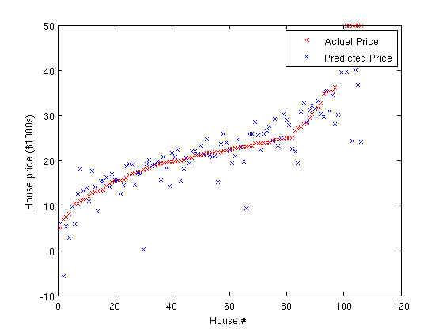

# 线性回归（Linear Regression）  
## 问题描述（Problem Formulation）  
我们（不妨）回顾一下（这些知识点），我们将从如何实现线性回归（Linear Regression）开始。这一节的主要思想是知道什么是目标函数（Objective Functions），计算其梯度（Gradients）以及通过一组参数来优化目标（函数）。这些基本的工具将会构建（在稍后教程中我们要讲到的）复杂的算法。想要更多学习资料的读者可以在参考<a href="http://cs229.stanford.edu/notes/cs229-notes1.pdf">监督学习讲座笔记</a>。  

在线性回归中，我们的目标是从一个输入值向量 $x\in \Re^{n}$，去预测目标值 $y$ 。例如，我们要预测房价，其中 $y$ 表示房子的（美元）价格， $x_{j}$ （ $j$ 是下角标，表示向量 $x$ 中第 $j$ 个元素）表示房子的第 $j$ 个特征，我们用特征来描述一个房子（如房子的面积，卧室的数目等）。假设我们现有很多房屋的数据（特征），其中比方说要表示第 $i$ 个房子的特征，表示为 $x^{(i)}$ （ $i$ 是上角标，表示该房屋样本是数据集里的第 $i$ 个样本），其房价表示为 $y^{(i)}$。简而言之，我们的目标是找到一个表示为 $y = h\left ( x \right )$ 的函数（ $h$ 是 $hypothesis$ 的缩写，在这里表示“假说”或“假设函数”），使训练集上的每个样本 $i$ 满足 $y^{(i)} \approx h( x^{(i)})$ 。如果我们成功找到了像 $h(x)$ 这样的函数，并且使其“看”过了足够多的房屋样本特征和房价，我们相信函数 $h(x)$ 将会是一个很好的房价预测器，即使是在那些它没有“见过”的房屋特征数据上（也会有好的预测结果）。  

为了能找到满足 $y^{(i)} \approx h( x^{(i)})$ 条件的函数 $h(x)$ ，我们首先需要做的是如何表示函数 $h(x)$。在表示该函数形式之初，我们先选择形如 $ h_{\theta}(x) = \sum _{j}\theta _{j}x_{j} = \theta^{\top}x $ 的线性函数。这里， $ h_{\theta}(x) $ 表示一组不同 $\theta$ 参数的函数家族（我们称该函数家族为“假设空间”或“假说空间”）。在表示完 $h$ 函数后，我们的任务是在条件 $ h( x^{(i)})$ 尽可能接近 $y^{(i)} $ 下，找到满足该条件的 $\theta $ 参数值。特别地，我们找的参数 $ \theta $ 是在下面这个函数最小化时候的 $ \theta $ 值：  

$$
J( \theta ) = \frac{1}{2} {\sum_{}^{i}}\left ( h_{\theta}(x^{(i)}) - y^{(i)} \right )^{2} = \frac{1}{2} {\sum_{}^{i}}\left ( {\theta}^{\top}x^{(i)} - y^{(i)} \right )^{2}
$$  

上面这个函数就是我们当前问题的“成本函数”或“代价函数”（Cost Function），它测量的是在特定 $\theta$ 值下，预测值（即 $h_{\theta}(x^{(i)})$ ）与 $y^{(i)}$ 相差程度。该函数也被称为“损失函数”（Loss Function），“惩罚函数”（Penalty Function）或“目标函数”（Objective Function）。  

## 函数最小化（Function Minimization）  
现在，我们要找到在函数 $J(\theta)$ 最小值时， ${\theta}$ 参数的值。实际上，有很多的算法都可以用来最小化函数，比方说我们这里即将提到的以及后面我们还会讲到一些高效率且易于自己实现的函数优化算法在后面的<a href="http://ufldl.stanford.edu/tutorial/supervised/OptimizationStochasticGradientDescent">梯度下降</a>（Gradient descent，注：原英文教程中，点击超链接后未跳转，这里给出的是后面讲到的优化方法——随机梯度下降，Stochastic Gradient Descent的链接）小节中。计算函数最小值通常需要准备有关目标函数（Objective Function） $J(\theta)$ 的两个部分：第一部分是写出计算目标函数 $J(\theta)$ 的代码，第二部分是写出目标函数（Objective Function） $J(\theta)$ 的微分项 $\triangledown _{\theta}J(\theta )$ ，以计算参数 $\theta$ 的值。  

之后，找到参数 $\theta$ 的最优值过程的其余部分将由优化算法来处理（回想一下，可微函数 $J(\theta)$ 的梯度 $\triangledown _{\theta}J(\theta )$ （即微分项），是一个指向函数 $J(\theta)$ 最陡（下降）增量的方向的矢量——所以，很容易看到优化算法如何在参数 $\theta$ 上使用这样的一个小变化量（的方法），来减小（或增加 $J(\theta)$，以求得函数最小或最大值）。  

对于上述 $J(\theta)$ 表达式，我们可通过 $x^{(i)}$ 和 $y^{(i)}$ 构成的训练数据集，较容易地在MATLAB里实现计算 $J(\theta)$ 来得到参数 $\theta$的值。但我们还需要计算另一部分，那就是梯度（项）：  

$$
\begin{bmatrix}
   \frac{\partial J(\theta))}{\partial \theta_1}
\\ \frac{\partial J(\theta))}{\partial \theta_2}
\\ .
\\ .
\\ .
\\ \frac{\partial J(\theta))}{\partial \theta_n}
\end{bmatrix}
$$  

在给定 $\theta$ 的参数值 $\theta_{j}$ 之后，目标函数（Objective Function）$J(\theta)$ 的微分结果表示为：  

$$
\frac{\partial J(\theta))}{\partial \theta_{j}} = {\sum_{i}^{}} x_{j}^{(i)}\left ( h_{\theta}(x^{(i)}) - y^{(i)} \right )
$$  

## 练习 1A：线性回归（Exercise 1A: Linear Regression）  
在本次练习中您将会使用MATLAB实现线性回归中的目标函数（Objective Function）和梯度计算（Gradient Copmutation）。  

在初学者代码（Starter Code）包中的 `ex1/` 目录下，您将会找到 `ex1_linreg.m` 文件，其包含了一个简单的线性回归（Linear Regression）的实验。该文件为您提供了大部分较为固定的步骤流程：  

1. 数据从 `housing.data` 文件中加载。一个额外的特征值“1”加入到数据集中，（与其对应的） $\theta_{1}$ （即 $\theta$ 向量中的第一个元素）在线性函数中是作为截距项存在的。  

2. 在数据集中的样本是随机排序的，同时数据被分成了训练集和测试集。被用来给学习算法作为输入的特征数据存储在变量 `train.X` 和 `tests.X`，被预测的目标值对每个样本即估计的房价。训练集样本和测试集样本的房价分别存储在 `train.y` 和 `test.y` 中。您将会用到训练集寻找最优的参数 $\theta$ 值来预测房价，并之后在测试集上检查（该最优参数 $\theta$ 的）表现。  

3. 该代码调用 minFunc 优化包。 minFunc 将试图在目标函数的最小值处，找到 $\theta$ 参数的最优值，目标函数已经在 `linear_regression.m` 中实现。您的任务是（在 linear_regression.m 中）实现在参数 $\theta$ 下目标函数及梯度的计算。  

4. 在minFunc（包的计算任务）完成后（如训练结束后），训练集和测试集的误差被打印出来。这一部分作为可选任务，您可以在测试集上对预测和实际价格进行快速的（数据）可视化。  

`ex1_linreg.m` 文件会调用 `linear_regression.m` 文件，换句话说，在您完成 `linear_regression.m` 文件里的代码后，您才可执行 `ex1_linreg.m` 文件（调用 `linear_regression.m` 文件）。`linear_regression.m` 文件接收训练数据 $X$，训练目标值（房价） $y$ 以及当前的参数 $\theta$ 。  

完成本练习的步骤如下：  

1. 完成 `linear_regression.m` 文件中的代码，使其可以针对线性回归问题计算早先定义的目标函数 $J(\theta)$ ，将计算结果保存至名为 $f$ 的变量中。您完成这两个步骤可通过循环训练集（数据矩阵 $X$ 中的列数据）上的样本进行，并且对于每个样本，将其贡献值增加给 $f$ 和 $g$。我们将在下一个练习中创建一个比当前更快的版本。  

当您成功地完成了练习，绘制的结果图看起来应该像下面这样：  
  
（您的图看起来可能会略有不同，这取决于随机选择的训练和测试集数据）  
特别地，训练集和测试集的均方根（RMS，Root Mean Square）误差值都是介于4.5和5之间。