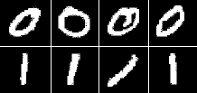

# 逻辑斯特回归（Logistic Regression）  
##  
在先前的学习中，我们学习了预测连续数值的方法（如预测房价），如把输入值（如房屋大小）传给线性的函数。有时候，我们反而希望预测离散变量（Discrete Variable），如预测网格中像素强度是代表一个“0”位还是一个“1”位。此时，这便是一个分类问题，逻辑斯特回归（Logistic Regression）对于学习做这样的（分类）决策来说是一种简单的方法。  

在线性回归中，我们尝试使用线性函数 $y = h_{\theta}(x) = \theta^{\top}x$ 来对第 $i$ 个样本 $x^{(i)}$ 预测其（可能的） $y^{(i)}$ 值。这显然不是一个解决二值类标签（ $y^{(i)}∈{\{0,1\}}$ )预测（问题）的好办法。在逻辑斯特回归（Logistic Regression）中，我们使用了一个（与先前学到的）不同的假设空间（Hypothesis Class）来尝试预测样本所属的类 $“1”$ 以及与其相对的类 $“0”$ 的概率。具体而言，我们将会尝试使用形式如下的函数进行学习：  

$$
P(y = 1 \mid x) = h_{\theta}(x) = \frac{1}{1+\exp{(-\theta^{\top}x)}} \equiv \sigma(\theta^{\top}x), $$
$$ P(y = 0 \mid x) = 1 - P(y = 1 \mid x) = 1 - h_{\theta}(x). 
$$  

函数 $\sigma(z) = \frac{1}{1 + \exp{(-z)}}$ 通常被称为 “ $sigmoid$ ” 或 “ $logistic$ ” （音译：逻辑斯特）函数——它是 $S$ 形的函数，其函数输入值 $\theta^{\top}x$ 通过 $S$ 型函数，被“挤”到 $[0,1]$ 区间上，所以我们也可将其值看成是概率。我们的目标是找到一个 $\theta$ 值，使其能满足：当 $x$ 属于 “1” 类时，$P(y = 1 \mid x ) = h_{\theta}(x)$ 的值很大；当 $x$ 属于 “0” 类时，$P(y = 0 \mid x ) = h_{\theta}(x)$ 的值很大。对于一组两类标记 ${\{(x^{(i)}, y^{(i)}); i = 1, ..., m\}}$ 的训练样本，我们使用下面的成本函数（Cost Function）来评估这个假设 $h_{\theta}$ 的好坏：  

$$
J(\theta) = -{\sum_{i}}\left (y^{(i)}\log{(h_{\theta}(x^{(i)}))} + (1-y^{(i)}) \log{(1 - h_{\theta}(x^{(i)}))}\right ).
$$  

需要注意的是，在上式的加和形式中，对每个训练样本，两项中只有一项是非零的（这取决于标记 $y^{(i)}$ 是 0 还是 1 ）。当 $y^{(i)} = 1$ 时，最小化成本函数意味着我们需要使 $h_{\theta}(x)$ 变大，而当 $y^{(i)} = 0$ 时，（正如前文所讲）我们也想要 $1 - h_{\theta}$ 变大。对于一个逻辑斯特回归（Logistic Regression）的完整解释以及成本函数（Cost Function）的推导过程，可以参考 <a href="http://cs229.stanford.edu/notes/cs229-notes1.pdf">CS229课程之监督学习</a> 部分。  

现在，我们有了可以测量可拟合训练数据的假说（或称为“假设函数”） $h_{\theta}$ 好坏的成本函数（Cost Function）。我们可以学习分类训练数据，通过最小化 $J(\theta)$ （的方法）来找参数 $\theta$ 的最优值。当我们完成了这一过程，我们便可对新的测试点通过计算所属“1”类和“0”类最可能的概率，进行分类。如果 $P(y=1 \mid x)>P(y=0 \mid x)$ ，那么该样本就将标记为“1”类，否则（$P(y=1 \mid x) < P(y=0 \mid x)$ ）标记为“0”类。其实，这好比检查 $h_{\theta} > 0.5 $ 是否成立。  

为了最小化 $J(\theta)$ ，我们可以使用类似线性回归（Linear Regression）的工具。我们需要提供一个可以在任意参数 $\theta$ 值时，可计算出 $J(\theta)$ 和（其微分结果的） $\triangledown_{\theta} J(\theta)$ 的函数。在给定参数 $\theta_{j}$ 时， $J(\theta)$ 的微分结果是：  

$$
\frac{\partial J(\theta)}{\partial \theta_{j}} = \sum_{i}x_{j}^{(i)} \left ( h_{\theta}(x^{(i)} - y^{(i)} )  \right ). 
$$  

若写成向量形式，其整个梯度可表示为：  

$$
\triangledown_{\theta} J(\theta) = \sum_{i}x^{(i)} \left ( h_{\theta}(x^{(i)} - y^{(i)} )  \right ).
$$  

除了当前的假设函数 $h_{\theta} = \sigma(\theta^{\top}x)$ ，这里的梯度计算与线性回归基本相同。  

## 练习 1B（Exercise 1B）  

本次练习的初学者代码已经在<a href="https://github.com/amaas/stanford_dl_ex">初学者代码（Starter Code）的 GitHub Rep</a> 中的 ex1/ 目录中。  

在本次练习中，您将会实现逻辑斯特回归（Logistic Regression）的目标函数（Objective Function）以及梯度计算（Gradient Computation），并使用您的代码从 <a href="http://yann.lecun.com/exdb/mnist/">MNIST 数据集</a> 中，学习分类数字（“0”或“1”的）图片。如下是列举的一些数字图片：  

  

我们使用 $28*28$ 像素规格来表示每个数字图片，我们将每张数字图片的格式变成有着 $28*28 = 784 $ 个元素的向量 $x^{(i)}$ 的形式。其类标记是 $y^{(i)}\in \{0,1\}$ 两种值中的一种。  

您可以在初学者代码（Starter Code）中的 `ex1/ex1b_logreg.m` 文件中找到本次的练习。初学者代码（Starter Code）文件里将会给您显示如下任务：  

1. 调用 `ex1_load_mnist.m` 文件将 MNIST 训练与测试集数据载入。之后读入像素值到矩阵 $X$ 中（第 $i$ 个样本的第 $j$ 个像素值就是 $X_{ji} = X_{j}^{(i)}$ ），同时为了标签行向量 $y$ 具有零均值和单位方差，（我们会）对像素强度做一些简单的标准化处理。尽管 <a href="http://yann.lecun.com/exdb/mnist/">MNIST 数据集</a> 包含了10个不同的数字（$0-9$），但在本次练习中，我们只将读取其中的数字 $0$ 和数字 $1$ —— ex1_load_mnist 函数将会为您做（数据载入）这些。  

2. 为了 $\theta_{0}$ 可以作为截距项（Intercept Term），我们在代码将中对参数 $\theta$ 后面追加一行数值 $1$。  

3. 代码将会调用 `minFunc包` 中的 `logistic_regression.m` 文件作为目标函数。您的任务是将 `logistic_regression.m` 文件中的代码补全，并使其返回目标函数值及其梯度值。  

4. 在 `minFunc包` （的计算）完成后，在训练集和测试集上的分类准确率将会打印出来。  

（类似先前的）线性回归中的练习，您将会实现 `logistic_regression.m`，（该文件中的代码）在所有的训练样本 $x^{(i)}$ 上进行循环，计算出目标函数 $J(θ;X,y)$ 的值。所得到的目标值将会保存在变量 $f$ 中。你也需要计算梯度 $\triangledown_{\theta}J(\theta; X, y)$ 并将其结果保存至变量 $g$ 中。当你完成了这些任务，你将可以运行 `ex1b_logreg.m` 中的代码来训练分类器并测试它（的性能）。  

如果您的代码工作正常，您将会发现您的分类器在训练集和测试集上能够达到100％的准确率！实际上，这是一个较简单的分类问题，因为数字 $0$ 和 $1$ 本身看起来就很不相同。在今后的练习中，想要得到像这样完美的结果其实是很困难的。