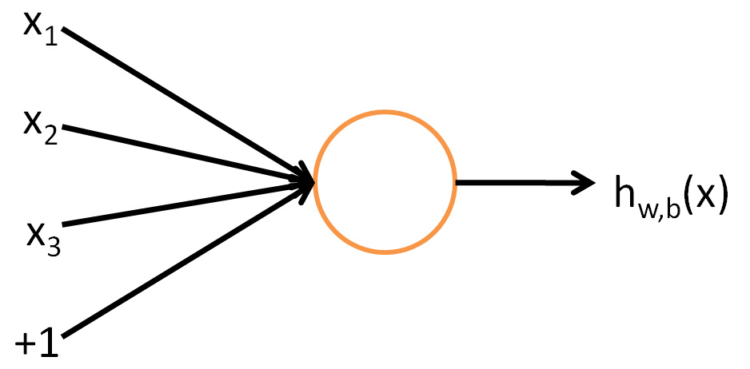
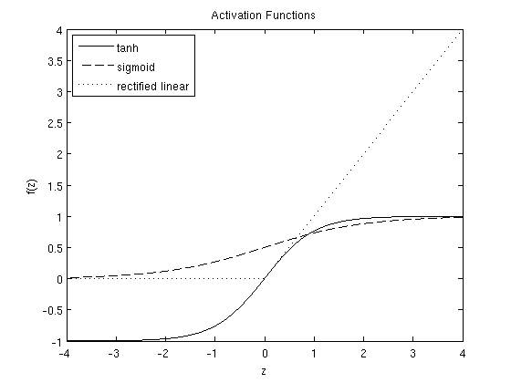

# 多层神经网络（Multi-Layer Neural Network）  
##  

考虑一个监督学习问题，即我们有机会得到带标签的训练样本 $(x^{(i)}, y^{(i)})$ 。神经网络给出了一种方式用来定义复杂以及非线性的假设形式 $h_{W,b}(x)$ ，该形式带有参数 $W, b$，这些参数可被用来拟合我们的数据。  

为描述神经网络，我们将开始描述一个最为简单的神经网络 —— 只有一个神经元。我们将用下面这幅图来表示这样的单个神经元：  

  

这个神经元是一个可以输入 $x1, x2, x3$ 的计算单元（其中， $+1$ 是截距项），并且它将会输出 $\textstyle h_{W,b}(x) = f(W^Tx) = f(\sum_{i=1}^3 W_{i}x_i +b)$ 。其中， $f : \Re \mapsto \Re$ 被称为“激活函数”。在这些笔记中，我们会选择 $f(\cdot)$ 作为我们的 S 型函数：  

$$
f(z) = \frac{1}{1+\exp(-z)}.
$$  

因此，单个神经元对应的是被定义为逻辑斯特回归的输入-输出映射。  

尽管这些笔记将会用在 $S$ 型函数，但很有必要说明的是，其它常见的 $f$ 的选择可以是双曲正切或正切函数：  

$$
f(z) = \tanh(z) = \frac{e^z - e^{-z}}{e^z + e^{-z}}.
$$  

最近的研究发现了一种与众不同的激活函数，整流线性激活函数（the rectified linear function），在实际中对于深层神经网络的效果更好。这种激活函数与 $S$ 型函数和双曲正切函数 $tanh$ 不同，因为其上限值不确定的，而且不是连续可微的。下面给出整流线性激活函数：  

$$
f(z) = \max(0,x).
$$  

下面是 $S$ 型函数，双曲正切函数 $tanh$ 以及整流线性函数：  

  

双曲正切函数 $tanh(z)$ 是 $S$ 型函数的一个缩放版本，其输出范围是 $[-1,1]$ ，而不是 $[０,1]$ 。整流线性函数是一个分段的线性函数，当输入 $z$ 值小于 $0$ 时，其函数值为 $
0$ 。  

Note that unlike some other venues (including the OpenClassroom videos, and parts of CS229), we are not using the convention here of x0=1. Instead, the intercept term is handled separately by the parameter b.  

需要注意的是，某些其它

Finally, one identity that’ll be useful later: If f(z)=1/(1+exp(−z)) is the sigmoid function, then its derivative is given by f′(z)=f(z)(1−f(z)). (If f is the tanh function, then its derivative is given by f′(z)=1−(f(z))2.) You can derive this yourself using the definition of the sigmoid (or tanh) function. The rectified linear function has gradient 0 when z≤0 and 1 otherwise. The gradient is undefined at z=0, though this doesn’t cause problems in practice because we average the gradient over many training examples during optimization.  

## 神经网络模型（Neural Network model）　　
A neural network is put together by hooking together many of our simple “neurons,” so that the output of a neuron can be the input of another. For example, here is a small neural network:　　

  

In this figure, we have used circles to also denote the inputs to the network. The circles labeled “+1” are called bias units, and correspond to the intercept term. The leftmost layer of the network is called the input layer, and the rightmost layer the output layer (which, in this example, has only one node). The middle layer of nodes is called the hidden layer, because its values are not observed in the training set. We also say that our example neural network has 3 input units (not counting the bias unit), 3 hidden units, and 1 output unit.
