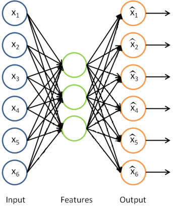
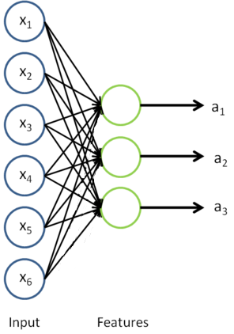

## 自我学习（Self Taught Learning）

注：本章节翻译完全参考旧版 UFLDL 中文教程。

### 1. 综述（Overview）

如果已经有一个足够强大的机器学习算法，为了获得更好的性能，最靠谱的方法之一是给这个算法以更多的数据。机器学习界甚至有个说法：“有时候胜出者并非有最好的算法，而是有更多的数据。”

人们总是尝试获取更多的已标注数据，但是这样做成本往往很高。例如研究人员已经花了相当的精力在使用类似 AMT（ Amazon Mechanical Turk ，译者注：一个众包模式的任务平台，研究人员将未标注的数据发布成任务并支付一定费用让别人对数据做标注）这样的工具上，以期获取更大的训练数据集。相比大量研究人员通过手工方式构建特征，用众包的方式让多人手工标数据是一个进步，但是我们可以做得更好。

具体的说，如果算法能够从未标注数据中学习，那么我们就可以轻易地获取大量无标注数据，并从中学习。自学习和无监督特征学习就是这种的算法。尽管一个单一的未标注样本蕴含的信息比一个已标注的样本要少，但是如果能获取大量无标注数据（比如从互联网上下载随机的、无标注的图像、音频剪辑或者是文本），并且算法能够有效的利用它们，那么相比大规模的手工构建特征和标数据，算法将会取得更好的性能。

**在自学习和无监督特征学习问题上，可以给算法以大量的未标注数据，学习出较好的特征描述。在尝试解决一个具体的分类问题时，可以基于这些学习出的特征描述和任意的（可能比较少的）已标注数据，使用有监督学习方法完成分类。**

在一些拥有大量未标注数据和少量的已标注数据的场景中，上述思想可能是最有效的。即使在只有已标注数据的情况下（这时我们通常忽略训练数据的类标号进行特征学习），以上想法也能得到很好的结果。

### 2. 特征学习（Learning features）

我们已经了解到如何使用一个自编码器（ autoencoder ）从无标注数据中学习特征。具体来说，假定有一个无标注的训练数据集 $\textstyle \{ x_u^{(1)}, x_u^{(2)}, \ldots, x_u^{(m_u)}\}$（下标 $\textstyle u$ 代表“不带类标”）。现在用它们训练一个稀疏自编码器（可能需要首先对这些数据做白化或其它适当的预处理）。

利用训练得到的模型参数 $\textstyle W^{(1)}, b^{(1)}, W^{(2)}, b^{(2)}$ ，给定任意的输入数据 $\textstyle x$ ，可以计算隐藏单元的激活量（ activations ） $\textstyle a$ 。如前所述，相比原始输入 $\textstyle x$ 来说，$\textstyle a$ 可能是一个更好的特征描述。下图的神经网络描述了特征（激活量 $\textstyle a$ ）的计算。

这实际上就是之前得到的稀疏自编码器，在这里去掉了最后一层（译者注：解码部分）。

假定有样本数量为 $\textstyle m_l$ 的已标注训练集 $\textstyle \{ (x_l^{(1)}, y^{(1)}), (x_l^{(2)}, y^{(2)}), \ldots (x_l^{(m_l)}, y^{(m_l)}) \}$（下标 $\textstyle l$ 表示“带类标”），我们可以为输入数据找到更好的特征描述。例如，可以将 $\textstyle x_l^{(1)}$ 输入到稀疏自编码器，得到隐藏单元激活量 $\textstyle a_l^{(1)}$ 。接下来，可以直接使用 $\textstyle a_l^{(1)}$ 来代替原始数据 $\textstyle x_l^{(1)}$ （“替代表示”， Replacement Representation ）。也可以合二为一，使用新的向量 $\textstyle (x_l^{(1)}, a_l^{(1)})$ 来代替原始数据 $\textstyle x_l^{(1)}$ （“级联表示”， Concatenation Representation ）。

>**两种特征表示方法**，在这里可能用“特征转换”更合适
>
>* 替代表示（ Replacement Representation ）：使用转移（或激活）函数 $f$ 映射的原样本得到的新特征 $f(x)$ 或称为 $a$ ，代替原样本 $x$ 作为特征；
>* 级联表示（ Concatenation Representation ）：使用经转移（或激活）函数 $f$ 映射后的特征 $f(x)$ 和原样本特征 $x$ 拼接起来得到的新特征 $\textstyle (x_l^{(1)}, a_l^{(1)})$ ，代替原样本 $x$ 作为特征。

经过变换后，训练集就变成 $\textstyle \{ (a_l^{(1)}, y^{(1)}), (a_l^{(2)}, y^{(2)}), \ldots (a_l^{(m_l)}, y^{(m_l)}) \}$ 或者是 $\textstyle \{ ((x_l^{(1)}, a_l^{(1)}), y^{(1)}), ((x_l^{(2)}, a_l^{(1)}), y^{(2)}), \ldots, ((x_l^{(m_l)}, a_l^{(1)}), y^{(m_l)}) \}$（取决于使用 $\textstyle a_l^{(1)}$ 替换 $\textstyle x_l^{(1)}$ 还是将二者合并）。**在实践中，将 $\textstyle a_l^{(1)}$ 和 $\textstyle x_l^{(1)}$ 合并通常表现的更好。但是考虑到内存和计算的成本，也可以使用替换操作**。

可以基于这样的特征训练一个有监督学习算法（例如支持向量机、逻辑斯特回归等），最终得到一个判别函数对 $\textstyle y$ 值进行预测。预测过程如下：给定一个测试样本 $\textstyle x_{\rm test}$ ，重复之前的过程，将其送入稀疏自编码器，得到 $\textstyle a_{\rm test}$ 。然后将 $\textstyle a_{\rm test}$ （或者 $\textstyle (x_{\rm test}, a_{\rm test})$ ）送入支持向量机或逻辑斯特回归的分类器中，得到预测值。

### 4. 数据预处理（On pre-processing the data）

>译者注：在将数据送入稀疏编码器前，我们可能已经对数据做了预处理操作，在这之后的训练和测试，也需要对数据做同样的预处理操作（比方需要将预处理中使用的参数保留起来，供后面训练和测试的时候使用，保证预处理的过程是一样的）。

在特征学习阶段，我们在未标注训练集 $\textstyle \{ x_u^{(1)}, x_u^{(2)}, \ldots, x_u^{(m_u)}\}$ 上学习，这一过程中可能计算了各种数据预处理参数。例如计算数据均值并且对数据做均值标准化（ mean normalization ）；或者对原始数据做主成分分析（ PCA ），然后将原始数据表示为 $\textstyle U^Tx$ （又或者使用 PCA 白化或 ZCA 白化）。

这样的话，有必要将这些参数保存起来，并且在后面的训练和测试阶段使用同样的参数，以保证数据进入稀疏自编码神经网络之前经过了同样的变换。例如，如果对未标注数据集进行 PCA 预处理，就必须将得到的矩阵 $\textstyle U$ 保存起来，并且应用到有标注训练集和测试集上；而不能使用有标注训练集重新估计出一个不同的矩阵 $\textstyle U$ （也不能重新计算均值并做均值标准化），否则的话可能得到一个完全不一致的数据预处理操作，导致进入自编码器的数据分布迥异于训练自编码器时的数据分布。

### 5. 无监督特征学习的术语（On the terminology of unsupervised feature learning）

有两种常见的无监督特征学习方式，区别在于您有什么样的未标注数据。**自学习（ self-taught learning ）是其中更为一般的、更强大的学习方式，它不要求未标注数据 $\textstyle x_u$ 和已标注数据 $\textstyle x_l$ 来自同样的分布。另外一种带限制性的方式也被称为半监督学习，它要求 $\textstyle x_u$ 和 $\textstyle x_l$ 服从同样的分布**。下面通过例子解释二者的区别。

假定有一个计算机视觉方面的任务，目标是区分汽车和摩托车图像；也即训练样本里面要么是汽车的图像，要么是摩托车的图像。哪里可以获取大量的未标注数据呢？最简单的方式可能是从互联网上下载一些随机的图像数据集，在这些数据上训练出一个稀疏自编码器，从中得到有用的特征。这个例子里，未标注数据完全来自于一个和已标注数据不同的分布（**未标注数据集中，或许其中一些图像包含汽车或者摩托车，但是不是所有的图像都如此**）。**这种情形被称为自学习（译者注：含有杂质图像）**。

相反，如果有**大量的未标注图像数据，要么是汽车图像，要么是摩托车图像，仅仅是缺失了类标号（没有标注每张图片不是汽车就是摩托车）**。也可以用这些未标注数据来学习特征。这种方式，即要求未标注样本和带标注样本服从相同的分布，有时候**被称为半监督学习**。在实践中，常常无法找到满足这种要求的未标注数据（到哪里找到一个每张图像不是汽车就是摩托车，只是丢失了类标号的图像数据库？）因此，自学习在无标注数据集的特征学习中应用更广。